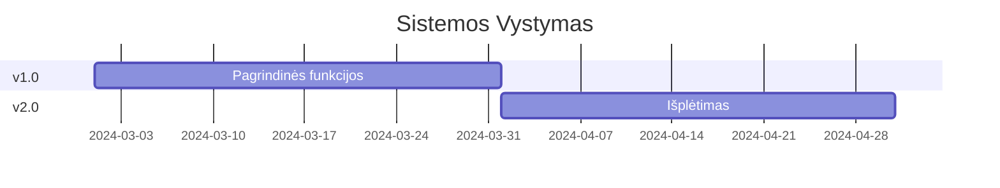

# Elektros Prekių Valdymo Sistema

## 1. Projekto Struktūra

```
ElektrosPrekes/
├── data/                           # Duomenų failai
│   ├── csv/                       # CSV duomenų failai
│   │   ├── klientai.csv          # ID,Kodas,Pavadinimas,Tipas,KreditoLimitas
│   │   ├── elektrikai.csv        # ID,Kodas,Vardas,Pavarde,TelNr,Email
│   │   ├── apsilankymai.csv      # ID,ElektrikasID,Data,Vieta,Pastabos
│   │   ├── produktai.csv         # ID,Kodas,Pavadinimas,Kaina,VntTipas,Kategorija
│   │   ├── sandelis.csv          # PrekeID,Kiekis,Vieta,Būsena,PaskutinisAtnaujinimas
│   │   ├── saskaitos.csv         # NR,Data,KlientasID,Suma,PVM,Tipas,Būsena
│   │   ├── grazinimai.csv        # NR,Data,SaskaitosNR,PrekeID,Kiekis,Priežastis
│   │   └── lokacijos.csv         # ID,Zona,Lentyna,Vieta,MaxSvoris,Tipas
│   ├── photos/                   # Nuotraukų saugykla
│   │   ├── grazinimai/          # Grąžinimų foto įrodymai
│   │   └── apsilankymai/        # Elektrikų apsilankymų foto
│   └── templates/               # Dokumentų šablonai
│       ├── saskaita.html       # Sąskaitos šablonas
│       ├── grazinimas.html     # Grąžinimo akto šablonas
│       └── sutartis.html       # Sutarties šablonas
│
├── src/                          # Pagrindinis projekto kodas
│   ├── ElektrosPrekes.Core/        # Verslo logikos branduolys (.cs failai)
│   │   ├── Constants/           # Sistemos konstantos
│   │   │   ├── SystemSettings.cs    # Sistemos nustatymai
│   │   │   ├── ErrorCodes.cs        # Klaidų kodai
│   │   │   └── ValidationRules.cs    # Validacijos taisyklės
│   │   │
│   │   ├── Domain/              # Sistemos modeliai
│   │   │   ├── Documents/      # Dokumentų modeliai
│   │   │   │   ├── Base/
│   │   │   │   │   ├── BaseDocument.cs           # Bazinė dokumentų klasė
│   │   │   │   │   ├── DocumentMetadata.cs       # Dokumento metaduomenys
│   │   │   │   │   └── DocumentValidation.cs     # Validacijos klasė
│   │   │   │   ├── Invoice/
│   │   │   │   │   ├── Invoice.cs                # Sąskaitos klasė
│   │   │   │   │   ├── InvoiceLine.cs           # Sąskaitos eilutės
│   │   │   │   │   └── InvoiceValidation.cs     # Sąskaitos validacija
│   │   ├── Domain/                # Sistemos modeliai
│   │   │   ├── Documents/        # Dokumentų modeliai
│   │   │   │   ├── Base/
│   │   │   │   ├── Invoice/
│   │   │   │   └── Returns/
│   │   │   ├── Warehouse/
│   │   │   │   ├── Products/
│   │   │   │   └── Stock/
│   │   │   └── Electricians/
│   │   ├── Interfaces/           # Sistemos sąsajos
│   │   │   ├── IDocumentService.cs
│   │   │   ├── IWarehouseService.cs
│   │   │   └── IElectricianService.cs
│   │   └── Services/             # Verslo logikos servisai
│   │       ├── DocumentService.cs
│   │       ├── WarehouseService.cs
│   │       └── ElectricianService.cs
│   │
│   ├── ElektrosPrekes.Infrastructure/  # Infrastruktūra
│   │   ├── Data/                    # Duomenų prieiga
│   │   │   ├── Context/
│   │   │   ├── Repositories/
│   │   │   └── CSV/
│   │   ├── Integration/            # Išorinės integracijos
│   │   │   ├── Scales/
│   │   │   ├── QR/
│   │   │   └── Printing/
│   │   └── Services/               # Infrastruktūros servisai
│   │
│   ├── ElektrosPrekes.Api/         # API sluoksnis
│   │   ├── Controllers/
│   │   ├── Middleware/
│   │   └── Models/
│   │
│   └── ElektrosPrekes.Shared/      # Bendri komponentai
│       ├── Constants/
│       └── Helpers/
│
├── tests/                         # Testavimo projektai
│   ├── ElektrosPrekes.UnitTests/
│   │   ├── Core/
│   │   │   ├── DocumentTests/
│   │   │   ├── WarehouseTests/
│   │   │   └── ElectricianTests/
│   │   └── Infrastructure/
│   │       ├── DataTests/
│   │       └── IntegrationTests/
│   │
│   └── ElektrosPrekes.IntegrationTests/
│
├── docs/                          # Dokumentacija
│   ├── architecture/
│   ├── api/
│   └── deployment/
│
└── tools/                         # Įrankiai ir skriptai
    ├── deployment/              # Diegimo skriptai
    │   ├── install.ps1         # Pagrindinis diegimo skriptas
    │   ├── db-setup.sql        # DB sukūrimo skriptas
    │   └── iis-config.ps1      # IIS konfigūracijos skriptas
    │
    ├── migration/              # Duomenų migracijos įrankiai
    │   ├── csv-import.ps1      # CSV importavimo įrankis
    │   ├── data-cleanup.ps1    # Duomenų valymo įrankis
    │   └── validation.ps1      # Duomenų validacijos įrankis
    │
    └── maintenance/            # Priežiūros įrankiai
        ├── backup.ps1          # Atsarginių kopijų skriptas
        ├── cleanup.ps1         # Valymo skriptas
        └── monitor.ps1         # Monitoringo skriptas
    ├── deployment/
    └── migration/
```

## 2. Pagrindiniai Sistemos Moduliai

### 2.1 Dokumentų Valdymo Modulis
```csharp
public abstract class BaseDocument
{
    public string Id { get; set; }
    public string Number { get; set; }
    public DateTime CreatedAt { get; set; }
    public DocumentStatus Status { get; set; }
}

public interface IDocumentService
{
    Task<T> CreateAsync<T>(T document) where T : BaseDocument;
    Task<T> UpdateAsync<T>(string id, T document) where T : BaseDocument;
    Task<bool> DeleteAsync(string id);
}
```

### 2.2 Sandėlio Valdymo Modulis
```csharp
public class Product
{
    public string Id { get; set; }
    public string Code { get; set; }
    public string Name { get; set; }
    public decimal Price { get; set; }
}

public interface IWarehouseService
{
    Task<Stock> GetStockAsync(string productId);
    Task<bool> UpdateStockAsync(string productId, decimal quantity);
    Task<WeightResult> WeighProductAsync(string productId);
}
```

### 2.3 Elektrikų Valdymo Modulis
```csharp
public class Electrician
{
    public string Id { get; set; }
    public string Code { get; set; }
    public string Name { get; set; }
    public decimal CreditLimit { get; set; }
}

public interface IElectricianService
{
    Task<Electrician> GetByIdAsync(string id);
    Task<bool> UpdateCreditLimitAsync(string id, decimal limit);
    Task<List<ElectricianList>> GetListsAsync(string electricianId);
}
```

## 3. Duomenų Struktūros

### 3.1 Duomenų Bazės Schema
```sql
CREATE TABLE Documents (
    Id NVARCHAR(50) PRIMARY KEY,
    Number NVARCHAR(20) UNIQUE,
    Type NVARCHAR(10),
    CreatedAt DATETIME,
    Status INT
);

CREATE TABLE Products (
    Id NVARCHAR(50) PRIMARY KEY,
    Code NVARCHAR(20) UNIQUE,
    Name NVARCHAR(200),
    UnitType NVARCHAR(10),
    Price DECIMAL(18,2)
);

CREATE TABLE Electricians (
    Id NVARCHAR(50) PRIMARY KEY,
    Code NVARCHAR(20) UNIQUE,
    Name NVARCHAR(100),
    CreditLimit DECIMAL(18,2)
);
```

### 3.2 CSV Failų Struktūra
```
elektrikai.csv
- ID,Kodas,Vardas,Pavarde,KreditoLimitas

prekes.csv
- ID,Kodas,Pavadinimas,Kaina,VntTipas

sandelis.csv
- PrekeID,Kiekis,Vieta,Busena
```

## 4. Sistemos Saugumas

### 4.1 Vartotojų Teisės
```csharp
public enum UserRole
{
    Admin,
    Accountant,
    Warehouseman,
    Salesperson
}

public interface ISecurityService
{
    Task<bool> HasPermissionAsync(string userId, string permission);
    Task<UserContext> GetCurrentUserAsync();
}
```

### 4.2 Duomenų Apsauga
```csharp
public interface IEncryptionService
{
    Task<string> EncryptAsync(string data);
    Task<string> DecryptAsync(string encryptedData);
}
```

## 5. Sistemos Monitoringas

### 5.1 Veiklos Metrikos
```csharp
public interface IMonitoringService
{
    Task<SystemHealth> CheckHealthAsync();
    Task<List<SystemMetric>> GetMetricsAsync();
    Task LogEventAsync(SystemEvent eventData);
}
```

### 5.2 Klaidų Sekimas
```csharp
public interface IErrorTracking
{
    Task LogErrorAsync(Exception ex, string context);
    Task<List<ErrorLog>> GetErrorLogsAsync(DateTime from, DateTime to);
}
```

## 6. Diegimo Instrukcijos

### 6.1 Reikalavimai
- .NET 7.0 SDK
- SQL Server 2019+
- Windows Server 2019/2022

### 6.2 Diegimo Žingsniai
1. Duomenų bazės sukūrimas
2. Aplikacijos diegimas
3. Servisų konfigūracija
4. Testavimas

## 7. Sistemos Plėtra

### 7.1 Planuojami Patobulinimai
- Mobili aplikacija
- Išplėstinė analitika
- Automatiniai užsakymai
- Tiekėjų integracija

### 7.2 Versijų Planas

## 1. SISTEMOS APŽVALGA

### 1.1 Sistemos Paskirtis
Sistema skirta modernizuoti elektros prekių pardavimo ir sandėlio valdymo procesus, apjungiant:
- Sandėlio valdymo sistemą
- Savitarnos sistemą
- Elektrikų aptarnavimo sistemą
- Pardavimų valdymą
- Grąžinimų sistemą
- Buhalterija
- Programinė ergonomika
- Kuo mažiau rankinio darbo

### 1.2 Pagrindiniai Sistemos Moduliai

```

### 3.12 Automatizuota Grąžinimų Valdymo Sistema

#### 3.12.1 Išmanusis Grąžinimų Priėmimas
```ascii
+----------------------------------------------------------+
| GRĄŽINIMŲ PRIĖMIMO SISTEMA       ↩️ Smart Returns         |
+----------------------------------------------------------+
| GRĄŽINIMO INICIJAVIMAS        | AUTOMATINĖ PATIKRA       |
|------------------------------|--------------------------|
| 1. INFORMACIJOS SURINKIMAS:   | PATIKROS TAŠKAI:        |
| ├── Elektriko ID: ✓          | □ Garantinis terminas   |
| ├── Sąrašo nr.: ✓           | □ Grąžinimo terminas    |
| ├── Prekių kodai: ✓         | □ Prekės būklė         |
| └── Kiekiai: ⏳             | □ Kiekio validacija    |
|                              |                         |
| 2. PREKIŲ VALIDACIJA:        | BŪSENA:                |
| ┌─────────────────┐          | ⏳ Vykdoma patikra     |
| │ YDYP 3x2.5     │          | Progresas: ██░░░░ 40%  |
| │ 50m iš 100m    │          |                         |
| │ Status: ⏳      │          | REIKIA DĖMESIO:        |
| └─────────────────┘          | ! Svorio patikra      |
|                              | ! Foto fiksacija       |
| [📸 Foto] [⚖️ Svoris]       |                         |
+----------------------------------------------------------+

1. **Grąžinimo Proceso Validacija**
```csharp
public interface IReturnValidationService {
    // Grąžinimo inicijavimas
    Task<ReturnSession> InitiateReturn(
        ReturnRequest request,
        ValidationOptions options
    );

    // Validacijos vykdymas
    Task<ValidationSteps> ProcessValidationSteps(
        string returnId,
        List<ValidationRule> rules
    );

    // Automatinis sprendimas
    Task<ReturnDecision> MakeAutomaticDecision(
        string returnId,
        DecisionCriteria criteria
    );
}

public class ReturnSession {
    public string ReturnId { get; set; }
    public string ElectricianId { get; set; }
    public string ListId { get; set; }
    public List<ReturnItem> Items { get; set; }
    public ReturnStatus Status { get; set; }
    public ValidationProgress Progress { get; set; }
    public List<RequiredAction> PendingActions { get; set; }
    public DateTime InitiatedAt { get; set; }
}
```

2. **Automatinė Būklės Patikra**
```ascii
+----------------------------------------------------------+
| PREKĖS BŪKLĖS PATIKRA            📋 Quality Check         |
+----------------------------------------------------------+
| PATIKROS KRITERIJAI           | FOTO DOKUMENTACIJA       |
|------------------------------|--------------------------|
| ✓ FIZINĖ BŪKLĖ:              | REIKALAVIMAI:           |
| ├── Pakuotė                  | • Min. 1 nuotraukos    |
| ├── Pažeidimai              | • Aiškus apšvietimas   |
| ├── Komplektacija           | • Pažeidimų fiksacija  |
| └── Švarumas                | • Markiruočių foto     |
|                              |                         |
| ✓ TECHNINIAI PARAMETRAI:     | BŪSENOS ĮVERTINIMAS:   |
| ├── Svorio patikra          | 🟢 Kaip nauja          |
| ├── Matmenys               | 🟡 Naudota            |
| ├── Markiruotė             | 🔴 Pažeista            |
| └── Funkcionalumas          | ⚫ Netinkama           |
+----------------------------------------------------------+
```

### 3.11 Išplėstinė Elektrikų Kredito Valdymo Sistema

#### 3.11.1 Kredito Rizikos Vertinimo Sistema
```ascii
+----------------------------------------------------------+
| KREDITO RIZIKOS VALDYMAS         💰 Risk Management       |
+----------------------------------------------------------+
| RIZIKOS VERTINIMAS             | KREDITO ISTORIJA        |
|------------------------------|--------------------------|
| PARAMETRAI:                   | Paskutiniai 6 mėn:      |
| ├── Mokėjimų istorija: 35%   | 03/24: ✓✓✓✓✓✓          |
| ├── Apyvarta: 25%           | 02/24: ✓✓✓✓✓⚠️          |
| ├── Grąžinimų kokybė: 20%   | 01/24: ✓✓✓✓✓✓          |
| ├── Verslo trukmė: 10%      | 12/23: ✓✓✓✓⚠️⚠️          |
| └── Rinkos sektorius: 10%    | 11/23: ✓✓✓✓✓✓          |
|                              | 10/23: ✓✓✓✓✓✓          |
| RIZIKOS LYGIS:               |                         |
| Bendras: ██████████ 95%     | MOKĖJIMŲ ANALIZĖ:       |
| Vidutinis vėlavimas: 1.2d   | Laiku: 95%              |
| Grąžinimų reitingas: A+     | Vėluoja: 5%             |
|                              | Vid. suma: 2,500€        |
| LIMITO REKOMENDACIJA:        |                         |
| Esamas: 5,000€              | SPECIALIOS SĄLYGOS:      |
| Rekomenduojamas: 7,500€     | ✓ Lojalus klientas      |
| Maksimalus: 10,000€         | ✓ Prioritetinis         |
+----------------------------------------------------------+

1. **Rizikos Vertinimo Algoritmas**
```csharp
public interface ICreditRiskService {
    // Rizikos vertinimas
    Task<RiskAssessment> AssessRisk(
        string electricianId,
        RiskAssessmentOptions options
    );

    // Limito skaičiavimas
    Task<CreditLimit> CalculateOptimalLimit(
        RiskAssessment risk,
        LimitCalculationOptions options
    );

    // Automatinis limito koregavimas
    Task<LimitAdjustment> AutoAdjustLimit(
        string electricianId,
        AdjustmentTrigger trigger
    );
}

public class RiskAssessment {
    public string ElectricianId { get; set; }
    public decimal RiskScore { get; set; }
    public Dictionary<string, decimal> ComponentScores { get; set; }
    public List<RiskFactor> IdentifiedRiskFactors { get; set; }
    public CreditRecommendation Recommendation { get; set; }
    public DateTime AssessmentDate { get; set; }
    public List<string> Warnings { get; set; }
}
```

#### 3.11.2 Automatinė Kredito Valdymo Sistema

1. **Kredito Limitų Automatizacija**
```ascii
+----------------------------------------------------------+
| KREDITO LIMITŲ VALDYMAS          🔄 Auto-Adjustment       |
+----------------------------------------------------------+
| LIMITO KOREGAVIMAS            | ĮSPĖJIMŲ SISTEMA        |
|------------------------------|--------------------------|
| AUTOMATINIAI TRIGGERIAI:      | AKTYVŪS ĮSPĖJIMAI:      |
| ├── 6 mėn be vėlavimų: +10%  | ! 2 vėluojantys mokėj.  |
| ├── Apyvartos augimas: +15%  | ! 1 viršytas limitas   |
| ├── Vėlavimai: -20%         | ! 3 grąžinimai         |
| └── Grąžinimai: -5%         |                         |
|                              | AUTOMATINIAI VEIKSMAI:   |
| LIMITŲ BŪSENOS:              | ✓ Limito sumažinimas   |
| ┌─────────────────┐          | ✓ Pranešimas vadybinin.|
| │ Aktyvūs: 125   │          | ✓ El. pašto siuntimas  |
| │ Viršyti: 3     │          |                         |
| │ Blokuoti: 1    │          | ISTORIJA:              |
| └─────────────────┘          | 03/25: Limitas +10%    |
|                              | 03/20: Įspėjimas       |
| SPECIALŪS ATVEJAI:           | 03/15: Blokavimas      |
| [Tvirtinti] [Blokuoti]      | 03/10: Limitas -5%     |
+----------------------------------------------------------+
```

2. **Kredito Operacijų Validacija**
```csharp
public interface ICreditOperationService {
    // Operacijos validavimas
    Task<ValidationResult> ValidateCreditOperation(
        CreditOperation operation,
        ValidationContext context
    );

    // Limito rezervavimas
    Task<ReservationResult> ReserveCreditAmount(
        string electricianId,
        decimal amount,
        ReservationOptions options
    );

    // Kredito operacijų sekimas
    Task<CreditUsage> TrackCreditUsage(
        string electricianId,
        TrackingOptions options
    );
}

public class CreditOperation {
    public string OperationId { get; set; }
    public string ElectricianId { get; set; }
    public decimal Amount { get; set; }
    public OperationType Type { get; set; }
    public DateTime RequestedAt { get; set; }
    public CreditValidation Validation { get; set; }
    public List<string> Approvals { get; set; }
    public OperationStatus Status { get; set; }
}
```

#### 3.11.3 Kredito Analitikos Sistema

1. **Realaus Laiko Kredito Monitoringas**
```ascii
+----------------------------------------------------------+
| KREDITO MONITORINGAS             📊 Live Monitoring       |
+----------------------------------------------------------+
| KREDITO NAUDOJIMAS             | ĮSPĖJIMŲ STATISTIKA     |
|------------------------------|--------------------------|
| ŠIANDIENOS OPERACIJOS:        | ĮSPĖJIMŲ TIPAI:         |
| ├── Nauji limitai: 5         | ├── Vėlavimai: 45%      |
| ├── Korekcijos: 3           | ├── Viršijimai: 30%     |
| ├── Blokavimas: 1           | ├── Grąžinimai: 15%     |
| └── Atblokavimas: 2         | └── Kiti: 10%           |
|                              |                         |
| BENDRAS KREDITO PORFELIS:     | TENDENCIJOS:           |
| Aktyvūs kreditai: 1.2M€      | ↗️ Limitų naudojimas   |
| Panaudota: 850K€            | ↘️ Vėlavimai           |
| Laisva: 350K€               | → Grąžinimai           |
|                              |                         |
| RIZIKOS PASISKIRSTYMAS:      | REKOMENDACIJOS:        |
| A+ : ████████░░ 80%         | • Peržiūrėti 3 limit.  |
| A  : ███████░░░ 70%         | • Didinti 5 klientams  |
| B  : ██████░░░░ 60%         | • Įspėti 2 klientus    |
+----------------------------------------------------------+
```

2. **Kredito Ataskaitų Sistema**
```csharp
public interface ICreditReportingService {
    // Ataskaitos generavimas
    Task<CreditReport> GenerateCreditReport(
        string electricianId,
        ReportType type,
        ReportOptions options
    );

    // Kredito analizė
    Task<CreditAnalysis> AnalyzeCreditPortfolio(
        AnalysisParameters parameters
    );

    // Prognozavimas
    Task<CreditForecast> ForecastCreditMetrics(
        string electricianId,
        ForecastPeriod period
    );
}

public class CreditReport {
    public string ReportId { get; set; }
    public ReportType Type { get; set; }
    public DateTime GeneratedAt { get; set; }
    public Dictionary<string, decimal> Metrics { get; set; }
    public List<CreditEvent> Events { get; set; }
    public List<ReportWarning> Warnings { get; set; }
    public Dictionary<string, object> AdditionalData { get; set; }
}
```

### 3.10 Išplėstinės Sandėlio Optimizacijos Sistema

#### 3.10.1 Sandėlio Optimizavimo Algoritmai
```ascii
+----------------------------------------------------------+
| SANDĖLIO OPTIMIZACIJOS VALDYMAS    🤖 AI-Powered          |
+----------------------------------------------------------+
| PREKIŲ IŠDĖSTYMAS              | JUDĖJIMO ANALIZĖ        |
|------------------------------|--------------------------|
| KRITERIJAI:                   | KARŠTOSIOS ZONOS:       |
| ├── Apyvartumas (ABC)        | A1-B2: ████ 85%         |
| ├── Fizinės savybės         | C3-D4: ███░ 65%         |
| ├── Grupavimas              | E5-F6: ██░░ 45%         |
| └── Prieinamumas            | G7-H8: █░░░ 25%         |
|                              |                         |
| AUTOMATINIS PERSKIRSTYMAS:    | EFEKTYVUMO METRIKOS:    |
| ┌─────────────────┐          | Vidut. kelias: -35%    |
| │ Zona A1        │          | Pakrovimo laikas: -42%  |
| │ → Kabeliai     │          | Klaidų kiekis: -65%    |
| │ → Automatai    │          | Darbo našumas: +45%     |
| └─────────────────┘          |                         |
|                              | REKOMENDACIJOS:         |
| OPTIMIZAVIMO CIKLAS:         | ! Perkelti YDYP į A1   |
| 🔄 Kasdien 22:00            | ! Grupuoti automatikus  |
+----------------------------------------------------------+

1. **Išdėstymo Optimizavimo Algoritmas**
```csharp
public interface ILayoutOptimizationService {
    // Optimizavimo logika
    Task<OptimizationPlan> GenerateOptimalLayout(
        List<StorageZone> currentLayout,
        List<Product> products,
        OptimizationCriteria criteria
    );

    // Perkėlimo užduočių generavimas
    Task<List<MovementTask>> GenerateMovementTasks(
        OptimizationPlan plan,
        MovementPriority priority
    );
}

public class OptimizationCriteria {
    public Dictionary<string, decimal> ProductWeights { get; set; }
    public Dictionary<string, int> AccessFrequency { get; set; }
    public Dictionary<string, List<string>> ProductGroups { get; set; }
    public Dictionary<string, PhysicalConstraints> ZoneConstraints { get; set; }
    public OptimizationPriority Priority { get; set; }
}
```

2. **Realaus Laiko Statistika ir Analizė**
```ascii
+----------------------------------------------------------+
| SANDĖLIO STATISTIKA               📊 Live Analytics       |
+----------------------------------------------------------+
| PREKIŲ JUDĖJIMAS               | DARBO EFEKTYVUMAS      |
|------------------------------|--------------------------|
| Einamoji valanda:            | Sandėlininkai:          |
| ↑ Išduota: 1250kg           | Jonas P.  ████████ 95%  |
| ↓ Priimta: 850kg           | Petras S. ███████░ 85%  |
| ↻ Perkelta: 450kg          | Marija K. ██████░░ 75%  |
|                              |                         |
| UŽIMTUMAS PAGAL ZONAS:       | KRITINIAI TAŠKAI:      |
| A1: ███████░░ 75%           | ! A1 beveik pilna      |
| B2: ████████░ 85%           | ! C3 per mažai vietos  |
| C3: ██████░░░ 65%           | ! E5 neoptimalus išd.  |
|                              |                         |
| PROCESO BŪSENOS:             | PROGNOZĖS:             |
| ✓ Priėmimas: 2 aktyvūs     | Užpildymas po 2d: 92%  |
| ✓ Išdavimas: 3 aktyvūs     | Kritinės prekės: 5     |
| ⚠️ Inventorizacija: 1       | Reikia perskirstymo: 3 |
+----------------------------------------------------------+
```

#### 3.10.2 Automatinio Perskirstymo Sistema

1. **Perskirstymo Logikos Schema**
```ascii
+----------------------------------------------------------+
| PERSKIRSTYMO LOGIKA              🔄 Auto-Redistribution   |
+----------------------------------------------------------+
|                    [ANALIZĖS VARIKLIS]                    |
|                           ↓                               |
|      [APYVARTUMO]  [GRUPAVIMO]  [PRIEINAMUMO]           |
|       ANALIZĖ      ANALIZĖ      ANALIZĖ                 |
|          ↓            ↓            ↓                     |
|                [SPRENDIMŲ MATRICA]                       |
|                        ↓                                 |
|               [OPTIMIZAVIMO LOGIKA]                      |
|                        ↓                                 |
|      [UŽDUOČIŲ]    [RESURSŲ]    [LAIKO]                |
|      PLANAVIMAS    VALDYMAS     PLANAVIMAS             |
|          ↓            ↓            ↓                     |
|              [VYKDYMO KONTROLĖ]                         |
|                        ↓                                 |
|               [REZULTATŲ ANALIZĖ]                       |
+----------------------------------------------------------+
```

2. **Perskirstymo Užduočių Valdymas**
```csharp
public interface IRedistributionService {
    // Perskirstymo poreikio analizė
    Task<RedistributionNeed> AnalyzeRedistributionNeed(
        AnalysisCriteria criteria
    );

    // Užduočių generavimas
    Task<List<RedistributionTask>> GenerateRedistributionTasks(
        RedistributionNeed need
    );

    // Užduočių vykdymo valdymas
    Task<RedistributionProgress> ManageRedistributionExecution(
        List<RedistributionTask> tasks
    );
}

public class RedistributionTask {
    public string TaskId { get; set; }
    public string ProductCode { get; set; }
    public string SourceLocation { get; set; }
    public string TargetLocation { get; set; }
    public decimal Quantity { get; set; }
    public TaskPriority Priority { get; set; }
    public TimeWindow ExecutionWindow { get; set; }
    public List<string> Dependencies { get; set; }
    public Dictionary<string, object> Metadata { get; set; }
}
```

3. **Optimizavimo Taisyklių Sistema**
```ascii
+----------------------------------------------------------+
| OPTIMIZAVIMO TAISYKLĖS           📋 Rules Management      |
+----------------------------------------------------------+
| PAGRINDINĖS TAISYKLĖS          | IŠIMTYS IR SPECIALŪS    |
|------------------------------|  ATVEJAI:                |
| 1. Apyvartumo taisyklės:     |                         |
|    • A klasė: Zonos A1-B2    | • Sunkios prekės       |
|    • B klasė: Zonos C3-D4    | • Pavojingos prekės    |
|    • C klasė: Zonos E5+      | • Didelės prekės       |
|                              |                         |
| 2. Grupavimo taisyklės:      | KONFLIKTŲ SPRENDIMAS:   |
|    • Pagal tipus            | 1. Apyvarta > Svoris   |
|    • Pagal tiekėjus         | 2. Svoris > Grupė      |
|    • Pagal projektus        | 3. Grupė > Vieta       |
|                              |                         |
| 3. Vietos taisyklės:         | REZULTATŲ VERTINIMAS:   |
|    • Svoris                 | • Efektyvumo metrikos  |
|    • Tūris                  | • Proceso trukmė       |
|    • Prieinamumas           | • Resursų naudojimas   |
+----------------------------------------------------------+
```ascii
+----------------------------------------------------------+

### 3.9 Sistemos Plėtros ir Mokymo Moduliai

#### 3.9.1 Vartotojų Apmokymo Sistema

1. **Interaktyvi Mokymo Aplinka**
```ascii
+----------------------------------------------------------+
| INTERAKTYVI MOKYMO SISTEMA       👤 Naujas Pardavėjas    |
+----------------------------------------------------------+
| MOKYMO MODULIAI               | PROGRESO SEKIMAS        |
|------------------------------|-------------------------|
| □ 1. SISTEMOS PAGRINDAI      | Progresas: ███░░ 60%   |
| ✓ Prisijungimas             | Testai: 4/6            |
| ✓ Navigacija               | Praktika: 8/12         |
| ▶️ Pardavimo procesas       | Laikas: 2h 15min       |
|                              |                        |
| □ 2. DARBAS SU PREKĖMIS      | SEKANTYS ŽINGSNIAI:    |
| ✓ Prekių paieška           | 1. Baigti pardavimo    |
| ✓ Svėrimo operacijos       |    proceso modulį      |
| ⏳ Grąžinimai              | 2. Pradėti grąžinimų   |
|                              |    modulį             |
| □ 3. DOKUMENTAI             |                        |
| ⏳ Sąskaitų išrašymas      | REKOMENDACIJOS:        |
| ⏳ Garantijos              | • Praktikuoti svėrimą  |
| ⏳ Grąžinimo aktai         | • Peržiūrėti video     |
|                              |   medžiagą            |
| INTERAKTYVIOS UŽDUOTYS:      |                        |
| [▶️ Simuliacija] [📝 Testas] | [📊 Rezultatai]       |
+----------------------------------------------------------+
```

2. **Praktinių Užduočių Simuliatorius**
```ascii
+----------------------------------------------------------+
| PARDAVIMO SIMULIATORIUS          UŽDUOTIS #5              |
+----------------------------------------------------------+
| SCENARIJUS: Elektriko grąžinimas su kredito limitu       |
|                                                           |
| UŽDUOTIS:                                                |
| 1. Priimti grąžinimą iš elektriko                       |
| 2. Patikrinti prekių būklę                              |
| 3. Atlikti svorio validaciją                            |
| 4. Sugeneruoti reikalingus dokumentus                    |
| 5. Atnaujinti kredito limitą                            |
|                                                           |
| INTERAKTYVUS TERMINALAS:                                 |
| ┌─────────────────────────────────────────────────┐      |
| │ > Pradėti grąžinimo procesą                     │      |
| │ > Įvesti elektriko kodą: _                      │      |
| │ >                                               │      |
| └─────────────────────────────────────────────────┘      |
|                                                           |
| PAGALBA:                       VERTINIMAS:               |
| [💡 Patarimai] [📖 Dokumentai] [✓ Tikrinti sprendimą]    |
+----------------------------------------------------------+
```

#### 3.9.2 Sistemos Plėtros Valdymas

1. **Versijų Planavimo Sistema**
```ascii
+----------------------------------------------------------+
| VERSIJŲ VALDYMAS                 v2.5 → v3.0              |
+----------------------------------------------------------+
| PLANUOJAMOS FUNKCIJOS          | DIEGIMO GRAFIKAS        |
|------------------------------|--------------------------|
| VERSIJA 3.0                   | 2024 Q2                 |
| ├── Mobili aplikacija        | ├── Testavimas: 04.15   |
| ├── AI rekomendacijos       | ├── Beta: 05.01        |
| ├── Automatinė inv.         | ├── Release: 05.15     |
| └── Tiekėjų portalas        | └── Stabilizacija: 06.01|
|                              |                         |
| VERSIJA 2.6                   | 2024 Q3                 |
| ├── Grąžinimų opt.          | ├── Pradžia: 07.01     |
| ├── Sandėlio anal.          | ├── Testavimas: 07.15   |
| └── Išplėsta apskaita       | └── Release: 08.01      |
|                              |                         |
| STATUS:                       | RESURSAI:              |
| Vystymas: ███░░░░░ 30%       | Komanda: 5 dev         |
| Testavimas: ██░░░░░░ 20%     | Biudžetas: OK          |
+----------------------------------------------------------+
```

2. **Plėtros Kontrolės Sistema**
```csharp
public interface ISystemUpgradeService {
    // Versijos diegimo valdymas
    Task<UpgradeSession> InitiateUpgrade(
        string targetVersion,
        UpgradeOptions options
    );

    // Automatinis testavimas
    Task<TestResult> RunAutomatedTests(
        string upgradeId,
        TestSuite suite
    );

    // Atsarginė kopija
    Task<BackupResult> CreateUpgradeBackup(
        string upgradeId
    );

    // Atstatymo planas
    Task<RollbackPlan> PrepareRollbackPlan(
        string upgradeId
    );
}

public class UpgradeSession {
    public string UpgradeId { get; set; }
    public string TargetVersion { get; set; }
    public List<UpgradeStep> Steps { get; set; }
    public UpgradeStatus Status { get; set; }
    public DateTime StartedAt { get; set; }
    public DateTime? CompletedAt { get; set; }
    public List<string> Logs { get; set; }
    public RollbackPlan RollbackPlan { get; set; }
}
```

#### 3.9.3 Sistemos Optimizavimo Įrankiai

1. **Našumo Analizės Sistema**
```ascii
+----------------------------------------------------------+
| NAŠUMO ANALIZĖ                  📊 Real-time Analytics    |
+----------------------------------------------------------+
| OPERACIJŲ SPARTA               | OPTIMIZACIJOS           |
|------------------------------|--------------------------|
| Pardavimas: 2.5s avg         | DB Indeksai: ✓          |
| Svėrimas: 1.2s avg          | Cache hit: 95%          |
| Dokumentai: 1.8s avg        | Query opt: ✓            |
|                              |                         |
| VARTOTOJŲ SESIJOS            | REKOMENDACIJOS:         |
| ├── Aktyvios: 125           | • Padidinti cache      |
| ├── Response: 180ms         | • Optimizuoti DB       |
| └── Errors: 0.1%            | • Atnaujinti indeksus  |
|                              |                         |
| RESURSŲ NAUDOJIMAS:          | TENDENCIJOS:           |
| CPU: ▁▂▃▅▇█▇▅▃▁             | ↗️ Vartotojų aug.: 15% |
| RAM: ▁▃▅▇█▇▅▃▁              | ↘️ Klaidų maž.: 25%   |
| I/O: ▁▂▃▅▆▅▃▂▁              | → Stabili sparta      |
+----------------------------------------------------------+
```

2. **Optimizavimo Servisas**
```csharp
public interface ISystemOptimizationService {
    // Sistemos analizė
    Task<PerformanceAnalysis> AnalyzePerformance(
        AnalysisOptions options
    );

    // Automatinis optimizavimas
    Task<OptimizationResult> OptimizeSystem(
        OptimizationTarget target,
        OptimizationOptions options
    );

    // Rekomendacijų generavimas
    Task<List<OptimizationRecommendation>> GetRecommendations();

    // Optimizavimo monitoringas
    Task<OptimizationMetrics> GetOptimizationMetrics();
}

public class OptimizationResult {
    public string OptimizationId { get; set; }
    public OptimizationTarget Target { get; set; }
    public List<OptimizationAction> Actions { get; set; }
    public Dictionary<string, decimal> Improvements { get; set; }
    public DateTime OptimizedAt { get; set; }
    public List<string> Warnings { get; set; }
}
```
|                 SISTEMOS MODULIAI                          |
+----------------------------------------------------------+
|                                                           |
|    [SANDĖLIS]  ←→  [PARDAVIMAI]  ←→  [SAVITARNA]         |
|        ↑               ↑                ↑                  |
|        |               |                |                  |
|    [SVARSTYKLĖS]  [DOKUMENTAI]     [TERMINALAI]          |
|        |               |                |                  |
|        ↓               ↓                ↓                  |
|    [APSKAITA]  ←→  [ELEKTRIKŲ]  ←→  [GRĄŽINIMAI]        |
|                     VALDYMAS                              |
|                                                           |
+----------------------------------------------------------+
```

### 1.3 Vartotojų Rolės ir Teisės

1. **Sandėlininkas**
   - Prekių priėmimas
   - Inventorizacija
   - Grąžinimų tvarkymas
   - Prekių išdavimas
   - Svėrimo operacijos

2. **Pardavėjas**
   - Klientų aptarnavimas
   - Pardavimų registravimas
   - Grąžinimų priėmimas
   - Sąskaitų išrašymas
   - Elektrikų sąrašų valdymas

3. **Elektrikas (Klientas)**
   - Savitarnos naudojimas
   - Sąrašų peržiūra
   - Grąžinimų inicijavimas
   - Kredito limito peržiūra
   - Dokumentų generavimas

4. **Administratorius**
   - Sistemos konfigūracija
   - Vartotojų valdymas
   - Kainodaros valdymas
   - Ataskaitų generavimas
   - Procesų stebėjimas

### 1.4 Sistemos Funkciniai Reikalavimai

#### 1.4.1 Sandėlio Valdymo Reikalavimai:
- Realaus laiko prekių likučių sekimas
- Automatinis lokacijų priskyrimas
- Integruota svarstyklių sistema
- QR/Barkodų skenavimo palaikymas
- Automatinė inventorizacija
- Grąžinimų valdymas

#### 1.4.2 Pardavimų Proceso Reikalavimai:
- Greitas pardavimo procesas (<2min)
- Automatinis dokumentų generavimas
- Integruota mokėjimų sistema
- Nuolaidų sistema
- Kreditų valdymas
- Elektrikų sąrašų valdymas

#### 1.4.3 Savitarnos Reikalavimai:
- Intuityvi vartotojo sąsaja
- Integruotos svarstyklės
- QR kodų nuskaitymas
- Automatinis kainų skaičiavimas
- Mokėjimų apdorojimas
- Grąžinimų inicijavimas

## 2. PAGRINDINIAI VERSLO PROCESAI

### 2.1 Pardavimo Procesas Savitarnoje

```ascii
+----------------------------------------------------------+
|                 SAVITARNOS PROCESAS                        |
+----------------------------------------------------------+
|                                                           |
| [1. IDENTIFIKACIJA]                                       |
|     ↓                                                     |
| [2. PREKIŲ SKENAVIMAS/SVĖRIMAS]                          |
|     ↓                                                     |
| [3. KREPŠELIO FORMAVIMAS]                                |
|     ↓                                                     |
| [4. AUTOMATINĖ PATIKRA]                                  |
|     ↓                                                     |
| [5. MOKĖJIMAS]                                           |
|     ↓                                                     |
| [6. DOKUMENTŲ GENERAVIMAS]                               |
|     ↓                                                     |
| [7. PREKIŲ PAĖMIMAS]                                     |
|                                                           |
| Vidutinis proceso laikas: 3-5 min                        |
| Procesą prižiūri: 1 pardavėjas (iki 4 terminalų)         |
|                                                           |
+----------------------------------------------------------+
```

### 2.2 Grąžinimų Procesas

```ascii
+----------------------------------------------------------+
|                 GRĄŽINIMŲ PROCESAS                         |
+----------------------------------------------------------+
|                                                           |
| [1. GRĄŽINIMO INICIJAVIMAS]                              |
|     ↓                                                     |
| [2. DOKUMENTŲ PATIKRA]                                   |
|     ↓                                                     |
| [3. PREKIŲ PATIKRA]                                      |
|     | → Svėrimas                                         |
|     | → Vizualinė apžiūra                               |
|     | → Funkcionalumo testas                            |
|     ↓                                                     |
| [4. SPRENDIMAS]                                          |
|     | → Priimti                                         |
|     | → Atmesti                                         |
|     | → Dalinai priimti                                |
|     ↓                                                     |
| [5. DOKUMENTŲ GENERAVIMAS]                               |
|     ↓                                                     |
| [6. SANDĖLIO ATNAUJINIMAS]                              |
|                                                           |
+----------------------------------------------------------+
```

### 2.3 Elektrikų Sąrašų Valdymas

```ascii
+----------------------------------------------------------+
|              ELEKTRIKŲ SĄRAŠŲ VALDYMAS                     |
+----------------------------------------------------------+
|                                                           |
| SĄRAŠO SUKŪRIMAS:                                        |
| ┌────────────────────┐     ┌────────────────────┐        |
| │ 1. Elektriko Info  │     │ Kredito Patikra    │        |
| │ 2. Objekto Info    │ →   │ Limitų Valdymas    │        |
| │ 3. Limitai         │     │ Istorijos Analizė  │        |
| └────────────────────┘     └────────────────────┘        |
|                                                           |
| SĄRAŠO VALDYMAS:                                         |
| ┌────────────────────┐     ┌────────────────────┐        |
| │ Prekių Pridėjimas  │     │ Būsenos:           │        |
| │ Kiekių Keitimas    │ →   │ ✓ Aktyvus          │        |
| │ Grąžinimai         │     │ ⚠️ Viršytas Limitas │        |
| └────────────────────┘     │ ❌ Užblokuotas      │        |
|                           └────────────────────┘        |
|                                                           |
+----------------------------------------------------------+
```

## 3. TECHNINĖ ARCHITEKTŪRA

### 3.2 Sandėlio Valdymo Modulis

#### 3.2.1 Sandėlio Darbo Vieta (Warehouse Dashboard)
```ascii
+----------------------------------------------------------+
| SANDĖLIO VALDYMAS                   👤 Sandėlininkas [⚙️] |
+----------------------------------------------------------+
| MENIU   | AKTYVIOS OPERACIJOS           STATISTIKA        |
|---------|------------------------------------------|
| □ Prmt  | 1. PRIĖMIMAS #PRI-001                    |
| □ Išdv  |    ├── YDYP 3x2.5 (500m) → A1-B2        |
| □ Grąž  |    └── Status: ⏳ Svėrimas               |
| □ Inv   |                                          |
|         | 2. IŠDAVIMAS #ISV-002                    |
| ZONA:   |    ├── NYM-J 3x1.5 (200m) → C3-D4       |
| A▼ B▼   |    └── Status: ✓ Paruošta                |
| ⚡ C□   |                                          |
| D□ E□   | 3. GRĄŽINIMAS #GRZ-003                   |
|         |    └── Status: ⚠️ Reikia patikros        |
| ĮRANGA: |------------------------------------------|
| ✓ Svar  | SANDĖLIO UŽIMTUMAS:                      |
| ✓ Sken  | Zona A: ███████░░ 70%                    |
| ✓ Sist  | Zona B: ████████░ 80%                    |
|         | Zona C: ██████░░░ 60%                    |
+----------------------------------------------------------+
| ⌨️ F2-Priimti | F3-Išduoti | F4-Grąžinti | F5-Inventorizuoti |
+----------------------------------------------------------+
```

#### 3.2.2 Svarstyklių Integracija
```ascii
+----------------------------------------------------------+
| SVĖRIMO PROCESAS                    🔄 Stabilizuojasi...  |
+----------------------------------------------------------+
| PREKĖ: YDYP 3x2.5                                         |
| BŪSENA: Laukiama stabilaus svorio                         |
|                                                           |
| DABARTINIS SVORIS:                                        |
| ┌──────────────────────────────────────┐                  |
| │                                      │                  |
| │           124.5 kg                   │                  |
| │     [██████████░░░░] 75%            │                  |
| │                                      │                  |
| └──────────────────────────────────────┘                  |
|                                                           |
| PARAMETRAI:                                               |
| Nulinė pozicija: ✓ OK         Min svoris: 0.5 kg         |
| Stabilumas: ⏳ 80%            Max svoris: 500.0 kg       |
| Tikslumas: ±0.1kg            Taros svoris: 1.2 kg        |
|                                                           |
| [⚖️ Nulinė] [📦 Tara] [✓ Fiksuoti] [❌ Atšaukti]        |
+----------------------------------------------------------+
```

#### 3.2.3 Prekių Priėmimo Procesas

1. **Priėmimo Inicijavimas**
   ```csharp
   public interface IReceivingService
   {
       // Priėmimo proceso pradžia
       Task<ReceivingSession> InitiateReceiving(
           string operatorId,
           string purchaseOrderId
       );

       // Prekės pridėjimas į priėmimą
       Task<ReceivingItem> AddItemToReceiving(
           string sessionId,
           string productCode,
           decimal quantity,
           decimal weight
       );

       // Priėmimo užbaigimas
       Task<ReceivingResult> CompleteReceiving(
           string sessionId,
           ReceivingCompletionDetails details
       );
   }
   ```

2. **Svorio Validacija**
   - Automatinis taros atėmimas
   - Minimalios/maksimalios ribos
   - Stabilumo patikrinimas (3 stabilūs matavimai)
   - Paklaidų skaičiavimas
   - Perspėjimai apie nukrypimus

3. **Lokacijos Priskyrimas**
   ```ascii
   +----------------------------------------------------------+
   | LOKACIJOS PRISKYRIMAS                                      |
   +----------------------------------------------------------+
   |                                                           |
   | PREKĖ: YDYP 3x2.5                                        |
   | KIEKIS: 500m                                             |
   |                                                           |
   | REKOMENDUOJAMOS LOKACIJOS:                               |
   | 1. A1-B2 ★★★★★                                           |
   |    └── Optimalus pasiekiamumas, 80% laisvos vietos       |
   | 2. C3-D4 ★★★★☆                                           |
   |    └── Geras pasiekiamumas, 60% laisvos vietos          |
   | 3. E5-F6 ★★★☆☆                                           |
   |    └── Vidutinis pasiekiamumas, 90% laisvos vietos      |
   |                                                           |
   | KRITERIJAI:                                              |
   | ✓ Prekės tipas                                          |
   | ✓ Apyvartumas                                           |
   | ✓ Svorio apribojimai                                    |
   | ✓ Zonos užimtumas                                       |
   |                                                           |
   +----------------------------------------------------------+
   ```

#### 3.2.4 Grąžinimų Tvarkymas

1. **Grąžinimų Darbo Vieta**
```ascii
+----------------------------------------------------------+
| GRĄŽINIMŲ TVARKYMAS                  #GRZ-2024-001        |
+----------------------------------------------------------+
| ELEKTRIKAS: Jonas Jonaitis           SĄRAŠAS: Plungė_46   |
|                                                           |
| GRĄŽINAMOS PREKĖS:                                       |
| ┌─────────────────────────────────────────────┐          |
| │ 1. YDYP 3x2.5                              │          |
| │    Kiekis: 50m iš 100m                     │          |
| │    Būklė: [✓] Nepanaudota  [ ] Sugadinta   │          |
| │    Svoris: 24.5 kg  (Nuokrypis: +0.1kg)    │          |
| │                                             │          |
| │ 2. Automatai C16                           │          |
| │    Kiekis: 5vnt iš 10vnt                   │          |
| │    Būklė: [✓] Originali pakuotė           │          |
| │    Patikra: ✓ Vizualinė  ✓ Funkcinė        │          |
| └─────────────────────────────────────────────┘          |
|                                                           |
| VEIKSMAI:                                                |
| [📸 Foto] [⚖️ Svoris] [✓ Priimti] [❌ Atmesti]          |
+----------------------------------------------------------+
```

2. **Grąžinimo Validacijos Procesas**
   - Automatinis svorio patikrinimas
   - Originalios pakuotės validacija
   - Vizualinė inspekcija su foto fiksacija
   - Funkcionalumo patikra
   - Automatinis kredito limito atnaujinimas

3. **Grąžinimo Dokumentacija**
   - Grąžinimo akto generavimas
   - Kreditinės sąskaitos išrašymas
   - Foto dokumentacijos pridėjimas
   - Kredito limito atstatymo dokumentas
   - Sandėlio operacijų fiksavimas

### 3.3 Elektrikų Valdymo Modulis

#### 3.3.1 Elektrikų Darbo Vieta
```ascii
+----------------------------------------------------------+
| ELEKTRIKO PROFILIS              👤 Jonas Jonaitis         |
+----------------------------------------------------------+
| SĄRAŠAI  | AKTYVUS SĄRAŠAS: Plungė, Telšių g. 46         |
|---------|----------------------------------------------|
| □ PLG46 | PREKĖS                    | KREDITO INFO     |
| □ TEL22 | ┌─────────────────┐       | Limitas: 5000€   |
| □ MAZ15 | │ YDYP 3x2.5      │       | Panaudota: 3500€ |
| □ KLP08 | │ 100m │ 0.75€/m  │       | Liko: 1500€     |
|         | │                 │       |                  |
| + NAUJAS| │ NYM-J 3x1.5     │       | MOKĖJIMAI       |
| Status: | │ 50m  │ 0.50€/m  │       | Vėluoja: 0      |
| ✓ Aktv  | │                 │       | Terminas: 30d    |
| ⚠️ Vėl  | │ Auto C16       │       |                  |
| ❌ Blok  | │ 10vnt│ 15€/vnt │       | DOKUMENTAI      |
|         | └─────────────────┘       | 📄 Sąskaitos     |
| VEIKSMAI| GRĄŽINIMAI              | 📄 Grąžinimai    |
| + Pirkt | ↩️ Galima: 80%          | 📄 Kreditinės    |
| ↩️ Gržt | ⌛ Terminas: 14d.       | 📄 Garantijos    |
+----------------------------------------------------------+
| SPECIALIOS SĄLYGOS: Lojalus klientas, 5% bazinė nuolaida |
+----------------------------------------------------------+
```

#### 3.3.2 Elektrikų Sąrašų Sistema

1. **Sąrašo Sukūrimas**
```ascii
+----------------------------------------------------------+
| NAUJAS SĄRAŠAS                       #PLG46-2024          |
+----------------------------------------------------------+
| PAGRINDINĖ INFO:                    | KREDITO PATIKRA     |
| Pavadinimas: Plungė, Telšių g. 46   | Status: ✓ OK       |
| Tipas: [✓] Objektas [ ] Klientas    | Rizika: Žema       |
| Galiojimas: 2024.03-2024.06         | Istorija: ★★★★☆    |
|                                     |                     |
| SĄLYGOS:                           | LIMITAI:            |
| Mokėjimo terminas: 30d             | Kredito: 5000€      |
| Nuolaidos: Bazinė 5%               | Mėnesio: 2000€      |
| Grąžinimo laikotarpis: 14d         | Vienkartinis: 1000€ |
|                                                           |
| PAPILDOMA INFO:                                          |
| [ ] Reikalingi pristatymai                               |
| [✓] Automatinis dokumentų siuntimas                      |
| [ ] Specialios kainos                                    |
|                                                           |
| [💾 Išsaugoti] [📋 Kopijuoti] [❌ Atšaukti]              |
+----------------------------------------------------------+
```

2. **Kredito Valdymo Sistema**
```ascii
+----------------------------------------------------------+
| KREDITO VALDYMAS                    #KRD-2024-001        |
+----------------------------------------------------------+
| ELEKTRIKO REITINGAS:               | KREDITO ISTORIJA    |
| ├── Mokėjimų istorija: ★★★★★       | 2024-03: 100% OK   |
| ├── Grąžinimų istorija: ★★★★☆      | 2024-02: 100% OK   |
| ├── Bendradarbiavimo: ★★★★★        | 2024-01: 1d vėl.   |
| └── Bendras: ★★★★★                 | 2023-12: 100% OK   |
|                                                           |
| LIMITAI IR NAUDOJIMAS:                                   |
| Kredito limitas:   ███████████░░░░░ 5000€/7000€         |
| Mėnesio limitas:   ████████░░░░░░░░ 1600€/2000€         |
| Vienkartinis:      ██████░░░░░░░░░░  600€/1000€         |
|                                                           |
| AUTOMATINIAI KOREGAVIMAI:                               |
| [✓] Automatinis limito didinimas                        |
| [✓] Nuolaidų priskyrimas                               |
| [✓] Mokėjimo termino pratęsimas                        |
|                                                           |
| [💰 Koreguoti] [📊 Istorija] [📄 Ataskaita]             |
+----------------------------------------------------------+
```

3. **Sąrašo Operacijos**
   ```csharp
   public interface IElectricianListService {
       // Sąrašo valdymas
       Task<ElectricianList> CreateListAsync(ElectricianListRequest request);
       Task<ElectricianList> UpdateListAsync(string listId, ListUpdateRequest request);
       Task<bool> DeactivateListAsync(string listId, DeactivationReason reason);
       
       // Prekių valdymas sąraše
       Task<ListItem> AddItemToListAsync(string listId, ListItemRequest item);
       Task<bool> UpdateItemQuantityAsync(string listId, string itemId, decimal newQuantity);
       Task<bool> RemoveItemFromListAsync(string listId, string itemId);
       
       // Kredito operacijos
       Task<CreditStatus> CheckCreditStatusAsync(string listId);
       Task<CreditAdjustment> AdjustCreditLimitAsync(string listId, CreditAdjustmentRequest request);
       Task<PaymentTerm> UpdatePaymentTermsAsync(string listId, PaymentTermRequest request);
   }
   ```

#### 3.3.3 Sąrašų Grąžinimų Valdymas

1. **Grąžinimo Inicijavimas**
```ascii
+----------------------------------------------------------+
| GRĄŽINIMAS IŠ SĄRAŠO              #PLG46-GRZ-001         |
+----------------------------------------------------------+
|                                                           |
| GALIMI GRĄŽINIMAI:                | GRĄŽINIMO INFO:      |
| ┌─────────────────┐              | Tipas: Nepanaudota   |
| │ ☐ YDYP 3x2.5   │              | Būklė: Originali     |
| │   Max: 50m     │              | Terminas: 14d        |
| │   Vnt: 0.75€   │              | Svoris: Reikalingas  |
| │                │              |                      |
| │ ☐ NYM-J 3x1.5  │              | REIKALAVIMAI:        |
| │   Max: 30m     │              | ✓ Originali pakuotė  |
| │   Vnt: 0.50€   │              | ✓ Nepažeista prekė   |
| │                │              | ✓ Svorio patikra     |
| │ ☐ Auto C16     │              | ✓ Vizualinė patikra  |
| │   Max: 5vnt    │              | □ Foto fiksacija     |
| │   Vnt: 15€     │              |                      |
| └─────────────────┘              |                      |
|                                                           |
| [↩️ Grąžinti] [📸 Foto] [📄 Dokumentai] [❌ Atšaukti]    |
+----------------------------------------------------------+
```

### 3.4 Savitarnos Sistema

#### 3.4.1 Savitarnos Terminalo Darbo Vieta
```ascii
+----------------------------------------------------------+
| SAVITARNA                         ID: TERM-01 | ⚡ Aktyvi  |
+----------------------------------------------------------+
| PREKIŲ KREPŠELIS            | SVĖRIMO ZONA               |
|---------------------------|---------------------------|
| 1. YDYP 3x2.5            | ⚖️ Padėkite prekę       |
|    50m × 0.75€ = 37.50€  |                         |
|    ✓ Svoris OK           | 0.0 kg                  |
|                          |                         |
| 2. Automatai C16         | Paskutinis svėrimas:    |
|    5vnt × 15€ = 75.00€   | YDYP 3x2.5: 24.5kg     |
|    ✓ Kiekis OK          | Status: ✓ Patvirtinta   |
|                          |                         |
| VISO: 112.50€           |                         |
| PVM (21%): 23.63€       | [⚖️ Sverti] [✓ Tvirt.]  |
| MOKĖTI: 136.13€         |                         |
|---------------------------|---------------------------|
| VEIKSMAI:                                           |
| [💳 Mokėti] [🔍 Ieškoti] [❌ Atšaukti] [ℹ️ Pagalba] |
+----------------------------------------------------------+
| BŪSENA: Laukiama prekės svėrimo...                      |
+----------------------------------------------------------+
```

#### 3.4.2 Svėrimo ir Patikros Sistema

1. **Svėrimo Proceso Schema**
```ascii
+----------------------------------------------------------+
| SVĖRIMO PROCESAS                                          |
+----------------------------------------------------------+
|                  ┌─────────────────┐                      |
|                  │  PADĖTI PREKĘ   │                      |
|                  └────────┬────────┘                      |
|                          ↓                                |
|              ┌──────────────────────┐                    |
|              │  STABILIZACIJA (2s)  │                    |
|              └──────────┬───────────┘                    |
|                        ↓                                  |
|            ┌─────────────────────────┐                   |
|            │   SVORIO VALIDACIJA     │                   |
|            └──────────┬──────────────┘                   |
|                      ↓                                    |
|        ┌─────────────────────────────────┐               |
|        │        PREKĖS PATIKRA           │               |
|        │  ┌────────────┐  ┌──────────┐   │               |
|        │  │  SVORIS    │  │ SISTEMA  │   │               |
|        │  │  24.5 kg   │  │ 24.4 kg  │   │               |
|        │  └────────────┘  └──────────┘   │               |
|        └─────────────────────────────────┘               |
|                      ↓                                    |
|         ┌────────────────────────────┐                   |
|         │    PATVIRTINIMAS/KLAIDA    │                   |
|         └────────────────────────────┘                   |
|                                                          |
+----------------------------------------------------------+
```

2. **Prekių Validacijos Procesas**
```csharp
public interface IProductValidationService {
    // Svorio validacija
    Task<WeightValidationResult> ValidateWeight(
        string productCode,
        decimal measuredWeight,
        ValidationOptions options
    );

    // Kiekio validacija
    Task<QuantityValidationResult> ValidateQuantity(
        string productCode,
        decimal requestedQuantity,
        decimal availableQuantity
    );

    // Kompleksinė validacija
    Task<ValidationResult> ValidateProductSale(
        string productCode,
        SaleValidationContext context
    );
}

public class WeightValidationResult {
    public bool IsValid { get; set; }
    public decimal ExpectedWeight { get; set; }
    public decimal MeasuredWeight { get; set; }
    public decimal Deviation { get; set; }
    public decimal DeviationPercentage { get; set; }
    public string ValidationMessage { get; set; }
    public ValidationType ValidationType { get; set; }
    public bool RequiresOperatorCheck { get; set; }
}
```

#### 3.4.3 Mokėjimų Sistema

1. **Mokėjimo Proceso Langas**
```ascii
+----------------------------------------------------------+
| MOKĖJIMAS                         Suma: 136.13€           |
+----------------------------------------------------------+
|                                                           |
| MOKĖJIMO BŪDAI:                                          |
| ┌─────────────────┐  ┌─────────────────┐  ┌────────────┐ |
| │  💳 KORTELĖ     │  │  💰 KREDITAS    │  │ 📱 MOBILUS │ |
| │  Bekontaktė    │  │  Limitas: 1500€ │  │  Paysera   │ |
| │  PIN           │  │  ✓ Galima      │  │  Revolut   │ |
| └─────────────────┘  └─────────────────┘  └────────────┘ |
|                                                           |
| PASIRINKTA: Kortelė                                      |
| BŪSENA: Laukiama kortelės pridėjimo...                   |
|                                                           |
| INSTRUKCIJOS:                                            |
| 1. Pridėkite kortelę prie terminalo                      |
| 2. Palaukite garso signalo                               |
| 3. Įveskite PIN kodą (jei reikia)                       |
| 4. Palaukite patvirtinimo                               |
|                                                           |
| [❌ Atšaukti] [🔄 Keisti būdą] [ℹ️ Pagalba]             |
+----------------------------------------------------------+
```

2. **Mokėjimo Apdorojimas**
```csharp
public interface IPaymentProcessingService {
    // Mokėjimo inicijavimas
    Task<PaymentSession> InitiatePayment(
        decimal amount,
        PaymentMethod method,
        PaymentContext context
    );

    // Mokėjimo apdorojimas
    Task<PaymentResult> ProcessPayment(
        string sessionId,
        PaymentDetails details
    );

    // Mokėjimo atšaukimas
    Task<RefundResult> ProcessRefund(
        string paymentId,
        RefundRequest request
    );

    // Būsenos tikrinimas
    Task<PaymentStatus> CheckPaymentStatus(
        string paymentId
    );
}

public class PaymentSession {
    public string SessionId { get; set; }
    public PaymentMethod Method { get; set; }
    public decimal Amount { get; set; }
    public string Currency { get; set; }
    public DateTime Created { get; set; }
    public DateTime ExpiresAt { get; set; }
    public PaymentStatus Status { get; set; }
    public Dictionary<string, object> Metadata { get; set; }
}
```

### 3.1 Sistemos Komponentai

```ascii
+-----------------------------------------------------------+
|                 SISTEMOS ARCHITEKTŪRA                       |
+-----------------------------------------------------------+
|                                                            |
| KLIENTAI:                                                  |
| [Savitarnos Terminalai] [Pardavėjų POS] [Mobilios Apps]   |
|                     ↓                                      |
| KOMUNIKACIJA:                                              |
| [REST API] ←→ [WebSocket] ←→ [SignalR]                    |
|                     ↓                                      |
| VERSLO LOGIKA:                                            |
| [Pardavimų] [Sandėlio] [Apskaitos] [Elektrikų] Servisai   |
|                     ↓                                      |
| DUOMENŲ SLUOKSNIS:                                        |
| [SQL Server] ←→ [Redis Cache] ←→ [File Storage]           |
|                     ↓                                      |
| INTEGRACIJOS:                                             |
| [Svarstyklės] [Mokėjimai] [Spausdintuvai] [Skeneriai]    |
|                                                            |
+-----------------------------------------------------------+
```

#### 2.3.3 Išplėstinė Mokesčių Valdymo Sistema

```ascii
+----------------------------------------------------------+
|  MOKESČIŲ VALDYMO SISTEMA                                 |
+----------------------------------------------------------+
|                                                           |
|   MOKESČIŲ SKAIČIAVIMAS           PVM DEKLARAVIMAS       |
|   ┌─────────────────────┐       ┌───────────────────┐    |
|   │ 1. Pardavimo PVM    │       │ FR0600 Rengimas   │    |
|   │    * 21% - 15000€   │       │ ┌─────────────┐   │    |
|   │    * 9%  - 2500€    │       │ │ 29 > 5000€  │   │    |
|   │    * 5%  - 500€     │       │ │ 30 > 2500€  │   │    |
|   │                     │       │ │ 31 > 1200€  │   │    |
|   │ 2. Pirkimo PVM      │       │ └─────────────┘   │    |
|   │    * 21% - 12000€   │       │                   │    |
|   │    * 9%  - 1800€    │       │ Terminas: 25d.    │    |
|   │    * 5%  - 300€     │       │ Būsena: Rengiama  │    |
|   └─────────────────────┘       └───────────────────┘    |
|                                                           |
|   MOKESČIŲ KALENDORIUS          AVANSINIAI MOKESČIAI    |
|   ┌─────────────────────┐       ┌───────────────────┐    |
|   │ 2024-03            │       │ Pelno mokestis    │    |
|   │ ┌─┬─┬─┬─┬─┬─┬─┐    │       │ Q1: 2500€        │    |
|   │ │1│2│3│4│5│6│7│    │       │ Q2: 2800€        │    |
|   │ ├─┼─┼─┼─┼─┼─┼─┤    │       │ Q3: 3000€        │    |
|   │ │🔵│ │⚠️│ │✓│ │ │    │       │ Q4: 3200€        │    |
|   │ └─┴─┴─┴─┴─┴─┴─┘    │       └───────────────────┘    |
|   └─────────────────────┘                                |
|                                                           |
|   LEGENDA:  🔵 Artėja  ⚠️ Vėluoja  ✓ Atlikta             |
|                                                           |
+----------------------------------------------------------+
```

##### Mokesčių Skaičiavimo Proceso Tobulinimas:

1. **Automatinis Tarifų Taikymas**
   - Prekių kategorijų žymėjimas PVM tarifams
   - Išimčių valdymas
   - Istorinių tarifų sekimas
   - Automatinis perskaičiavimas pasikeitus tarifams

2. **Išplėstinė PVM Analizė**
   - Realaus laiko PVM pozicijos stebėjimas
   - Mokėtino/grąžintino PVM prognozės
   - PVM srautų optimizavimas
   - Rizikos zonų identifikavimas

3. **Deklaracijų Automatizavimas**
   - Automatinis duomenų surinkimas
   - Išankstinė validacija
   - Klaidų prevencija
   - Automatinis pateikimas i.SAF sistemai

#### 2.3.4 Išplėstinė Ataskaitų Generavimo Sistema

```ascii
+----------------------------------------------------------+
|  ATASKAITŲ VALDYMO CENTRAS                               |
+----------------------------------------------------------+
|                                                           |
|   STANDARTINĖS ATASKAITOS     ANALITINĖS ATASKAITOS     |
|   ┌─────────────────────┐     ┌─────────────────────┐    |
|   │ 📊 Dienos Ataskaita │     │ 📈 Pardavimų Analizė│    |
|   │ 📊 Mėnesio Balansas │     │ 📉 Pelningumo Anal. │    |
|   │ 📊 PVM Ataskaita    │     │ 📊 Klientų Segmentai│    |
|   │ 📊 Skolų Ataskaita  │     │ 📈 Prekių ABC Anal. │    |
|   └─────────────────────┘     └─────────────────────┘    |
|                                                           |
|   ATASKAITŲ PLANAVIMAS        AUTOMATINIS SIUNTIMAS     |
|   ┌─────────────────────┐     ┌─────────────────────┐    |
|   │ 📅 Kasdienės        │     │ 📧 Vadovybei       │    |
|   │ 📅 Savaitinės       │     │ 📧 Buhalterijai    │    |
|   │ 📅 Mėnesinės        │     │ 📧 Pardavimams     │    |
|   │ 📅 Ketvirtinės      │     │ 📧 Sandėliui       │    |
|   └─────────────────────┘     └─────────────────────┘    |
|                                                           |
|   EKSPORTO FORMATAI:                                     |
|   [PDF] [EXCEL] [CSV] [XML] [JSON] [FINVALDA]           |
|                                                           |
+----------------------------------------------------------+
```

##### Ataskaitų Sistemos Tobulinimas:

1. **Dinaminių Ataskaitų Kūrimas**
   - Vartotojo apibrėžti parametrai
   - Interaktyvūs filtrai
   - Drill-down galimybės
   - Realaus laiko atnaujinimas

2. **Išplėstinė Analizė**
   - Trenčių analizė
   - Prognozavimo modeliai
   - KPI stebėjimas
   - Nuokrypių analizė

3. **Automatizuotas Paskirstymas**
   - Išankstinis planavimas
   - Sąlyginės taisyklės
   - Formatų konvertavimas
   - Pristatymo patvirtinimai

#### 2.3.5 Periodo Uždarymo Automatizavimas

```ascii
+----------------------------------------------------------+
|  PERIODO UŽDARYMO PROCESAS                               |
+----------------------------------------------------------+
|                                                           |
|   PASIRUOŠIMAS              UŽDARYMO OPERACIJOS         |
|   ┌────────────────┐        ┌────────────────────┐      |
|   │ 1. Duomenų     │        │ 1. Inventorizacija │      |
|   │    Validacija  │  →→→   │ 2. Nurašymai      │      |
|   │ 2. Likučių     │        │ 3. Sukaupimas     │      |
|   │    Sutikrinimas│        │ 4. PVM Apskaita   │      |
|   └────────────────┘        └────────────────────┘      |
|           ↓                           ↓                  |
|   DOKUMENTACIJA            REZULTATŲ FORMAVIMAS         |
|   ┌────────────────┐        ┌────────────────────┐      |
|   │ 1. Aktai       │        │ 1. Balansas       │      |
|   │ 2. Žiniaraščiai│  ←←←   │ 2. P/N Ataskaita  │      |
|   │ 3. Deklaracijos│        │ 3. Srautų Atas.   │      |
|   │ 4. Suderinimas │        │ 4. Analitika      │      |
|   └────────────────┘        └────────────────────┘      |
|                                                           |
|   PROGRESAS: ██████████████░░░░░░ 70%                    |
|   Liko:  5 operacijos  |  Terminas: 2024-04-05          |
|                                                           |
+----------------------------------------------------------+
```

##### Periodo Uždarymo Proceso Tobulinimas:

1. **Automatinė Pasiruošimo Fazė**
   - Išankstinė klaidų detekcija
   - Trūkstamų duomenų identifikavimas
   - Automatiniai priminimai
   - Proceso validacija

2. **Operacijų Automatizavimas**
   - Automatinis nurašymų skaičiavimas
   - Sukaupimų formavimas
   - PVM koregavimai
   - Valiutų perskaičiavimai

3. **Rezultatų Formavimas**
   - Automatinis ataskaitų generavimas
   - Palyginamoji analizė
   - Nuokrypių ataskaitos
   - Istorinių duomenų kaupimas

#### 2.3.6 Biudžetų Valdymo Sistema

```ascii
+----------------------------------------------------------+
|  BIUDŽETŲ VALDYMO SISTEMA                                |
+----------------------------------------------------------+
|                                                           |
|   BIUDŽETŲ PLANAVIMAS         REALAUS LAIKO SEKIMAS     |
|   ┌────────────────────┐      ┌────────────────────┐     |
|   │ Metinis: 1.2M€     │      │ Pardavimai: 92%    │     |
|   │ ├─ Q1: 250K€      │      │ ├─ Online: 95%     │     |
|   │ ├─ Q2: 350K€      │      │ ├─ Savitarna: 88%  │     |
|   │ ├─ Q3: 400K€      │      │ └─ Tiesioginiai: 94%│     |
|   │ └─ Q4: 200K€      │      │                    │     |
|   └────────────────────┘      └────────────────────┘     |
|                                                           |
|   NUOKRYPIŲ ANALIZĖ          PROGNOZĖS                  |
|   ┌────────────────────┐      ┌────────────────────┐     |
|   │ Pardavimai: +5%    │      │ Q2 Prognozė:      │     |
|   │ Sąnaudos: -2%      │      │ ├─ Optimist: 380K€│     |
|   │ Pelnas: +8%        │      │ ├─ Realus: 355K€  │     |
|   │ ROI: +3%           │      │ └─ Pesimist: 330K€│     |
|   └────────────────────┘      └────────────────────┘     |
|                                                           |
|   KOREGAVIMO VEIKSMAI:                                  |
|   [Peržiūrėti] [Koreguoti] [Patvirtinti] [Atmesti]     |
|                                                           |
+----------------------------------------------------------+
```

##### Biudžetų Sistemos Tobulinimas:

1. **Išplėstinis Planavimas**
   - Scenarijų modeliavimas
   - Istorinių duomenų analizė
   - Sezoninių faktorių įvertinimas
   - Automatinės korekcijos

2. **Realaus Laiko Kontrolė**
   - KPI stebėjimas
   - Nuokrypių detekcija
   - Automatiniai įspėjimai
   - Korekcinių veiksmų siūlymai

3. **Prognozavimo Sistema**
   - Machine Learning algoritmai
   - Rinkos tendencijų analizė
   - Rizikos faktorių vertinimas
   - Automatinis scenarijų generavimas

Ar norite, kad tęsčiau su:
1. Sandėlio Valdymo Sistemos detalizavimu
2. Darbuotojų/Vartotojų Prieigos Valdymo Sistema
3. Integracijos su Išorinėmis Sistemomis
4. Apsaugos ir Audito Sistema

?                GeneratedAt = DateTime.UtcNow,
                GeneratedBy = request.UserId,
                CompanyInfo = await GetCompanyInfo(),
                LegalRequirements = await GetLegalRequirements(request.DocumentType),
                Formatting = await GetFormattingRules(request.DocumentType)
            }
        };
    }
    
    private async Task ApplyNumbering(
        Document document, 
        NumberingStrategy strategy)
    {
        var numberingService = new DocumentNumberingService();
        
        // Numeracijos formatas pagal dokumentų tipus
        var format = new NumberingFormat
        {
            Prefix = GetDocumentPrefix(document.Type), // SF-, KRD-, etc.
            Year = DateTime.Now.Year.ToString().Substring(2), // 24
            Separator = "-",
            SequenceLength = 6, // 000001
            Suffix = GetDocumentSuffix(document.Type)
        };

        // Gauname sekantį numerį
        var nextNumber = await numberingService.GetNextNumberAsync(
            document.Type,
            format
        );

        document.Number = nextNumber;
        
        // Registruojame numerio panaudojimą
        await numberingService.RegisterNumberUsageAsync(
            document.Type,
            nextNumber,
            document.Id
        );
    }
}

#### 2.3.2 Išplėstinė Finansinių Operacijų Sistema

```ascii
+----------------------------------------------------------+
|  FINANSINIŲ OPERACIJŲ VALDYMAS                           |
+----------------------------------------------------------+
|                                                           |
|   OPERACIJŲ SRAUTAI         BALANSO KONTROLĖ            |
|   ┌─────────────────┐       ┌───────────────────┐        |
|   │ → Pardavimai    │       │ Debetas: 125000€  │        |
|   │ ← Grąžinimai    │       │ Kreditas: 85000€  │        |
|   │ ↓ Nurašymai     │       │ Balansas: 40000€  │        |
|   │ ↑ Pajamavimas   │       └───────────────────┘        |
|   └─────────────────┘                                    |
|                                                           |
|   PERIODO UŽDARYMAS       FINANSINĖ ANALIZĖ             |
|   ┌─────────────────┐       ┌───────────────────┐        |
|   │ 1. Suderinimas  │       │ ROI: 15.5%        │        |
|   │ 2. Nurašymai    │       │ Marža: 22.3%      │        |
|   │ 3. PVM          │       │ Apyvarta: 250K€   │        |
|   │ 4. Rezultatai   │       └───────────────────┘        |
|   └─────────────────┘                                    |
|                                                           |
+----------------------------------------------------------+
```

```csharp
public interface IFinancialOperationsService
{
    // Operacijų registravimas
    Task<OperationResult> RegisterOperationAsync(
        FinancialOperation operation,
        OperationOptions options
    );
    
    // Balanso kontrolė
    Task<BalanceResult> ValidateBalanceAsync(
        string accountId,
        BalanceValidationOptions options
    );
    
    // Periodo uždarymas
    Task<ClosingResult> CloseFinancialPeriodAsync(
        string periodId,
        ClosingOptions options
    );
}

public class FinancialOperationsService : IFinancialOperationsService
{
    private readonly IAccountingRepository _accountingRepo;
    private readonly IValidationService _validationService;
    private readonly IDocumentService _documentService;
    private readonly ITaxService _taxService;
    private readonly ILogger<FinancialOperationsService> _logger;

    public async Task<OperationResult> RegisterOperationAsync(
        FinancialOperation operation,
        OperationOptions options)
    {
        try
        {
            // 1. Operacijos validacija
            var validation = await ValidateOperation(operation);
            if (!validation.IsValid)
                throw new InvalidOperationException(validation.Errors);

            // 2. Dvigubo įrašo principo taikymas
            var entries = GenerateAccountingEntries(operation);
            
            // 3. Balanso patikrinimas
            var balanceCheck = await ValidateBalance(entries);
            if (!balanceCheck.IsBalanced)
                throw new UnbalancedOperationException(balanceCheck.Discrepancy);

            // 4. PVM skaičiavimas ir patikra
            var taxCalculation = await _taxService.CalculateTaxesAsync(operation);
            
            // 5. Operacijos registravimas
            var registeredOperation = await _accountingRepo.RegisterOperationAsync(
                new AccountingOperation
                {
                    OperationId = Guid.NewGuid(),
                    Type = operation.Type,
                    Entries = entries,
                    TaxDetails = taxCalculation,
                    Date = DateTime.UtcNow,
                    Period = DeterminePeriod(operation.Date),
                    Status = OperationStatus.Registered,
                    Metadata = GenerateMetadata(operation)
                }
            );

            // 6. Dokumentų generavimas
            var documents = await _documentService.GenerateOperationDocumentsAsync(
                registeredOperation,
                options.DocumentOptions
            );

            // 7. Analitikos atnaujinimas
            await UpdateAnalytics(registeredOperation);

            return new OperationResult
            {
                Success = true,
                OperationId = registeredOperation.OperationId,
                Entries = entries,
                TaxDetails = taxCalculation,
                Documents = documents,
                GeneratedAt = DateTime.UtcNow
            };
        }
        catch (Exception ex)
        {
            _logger.LogError(ex, "Failed to register financial operation");
            throw;
        }
    }

    private async Task<BalanceResult> ValidateBalance(
        IEnumerable<AccountingEntry> entries)
    {
        decimal totalDebits = 0;
        decimal totalCredits = 0;
        var accountBalances = new Dictionary<string, decimal>();

        // 1. Skaičiuojame sumas pagal debetą/kreditą
        foreach (var entry in entries)
        {
            if (entry.EntryType == EntryType.Debit)
                totalDebits += entry.Amount;
            else
                totalCredits += entry.Amount;

            // Kaupiame balansus pagal sąskaitas
            if (!accountBalances.ContainsKey(entry.AccountId))
                accountBalances[entry.AccountId] = 0;

            accountBalances[entry.AccountId] += entry.EntryType == EntryType.Debit 
                ? entry.Amount 
                : -entry.Amount;
        }

        // 2. Tikriname balansą
        var isBalanced = Math.Abs(totalDebits - totalCredits) < 0.01m;
        
        // 3. Tikriname sąskaitų limitus
        var limitViolations = new List<LimitViolation>();
        foreach (var balance in accountBalances)
        {
            var accountLimits = await _accountingRepo.GetAccountLimitsAsync(
                balance.Key
            );
            
            if (accountLimits.HasLimit)
            {
                if (balance.Value < accountLimits.MinBalance)
                    limitViolations.Add(new LimitViolation
                    {
                        AccountId = balance.Key,
                        ViolationType = ViolationType.BelowMinimum,
                        CurrentValue = balance.Value,
                        LimitValue = accountLimits.MinBalance
                    });
                    
                if (balance.Value > accountLimits.MaxBalance)
                    limitViolations.Add(new LimitViolation
                    {
                        AccountId = balance.Key,
                        ViolationType = ViolationType.AboveMaximum,
                        CurrentValue = balance.Value,
                        LimitValue = accountLimits.MaxBalance
                    });
            }
        }

        return new BalanceResult
        {
            IsBalanced = isBalanced,
            TotalDebits = totalDebits,
            TotalCredits = totalCredits,
            Discrepancy = totalDebits - totalCredits,
            AccountBalances = accountBalances,
            LimitViolations = limitViolations,
            ValidationDate = DateTime.UtcNow
        };
    }

    public async Task<ClosingResult> CloseFinancialPeriodAsync(
        string periodId,
        ClosingOptions options)
    {
        // 1. Periodo validacija
        var periodValidation = await ValidatePeriod(periodId);
        if (!periodValidation.IsValid)
            throw new InvalidPeriodException(periodValidation.Errors);

        // 2. Neužbaigtų operacijų patikrinimas
        var pendingOperations = await _accountingRepo.GetPendingOperationsAsync(
            periodId
        );
        
        if (pendingOperations.Any())
            throw new PendingOperationsException(pendingOperations);

        try
        {
            // 3. Periodo uždarymo proceso inicijavimas
            var closingProcess = new PeriodClosingProcess
            {
                PeriodId = periodId,
                StartedAt = DateTime.UtcNow,
                Steps = new List<ClosingStep>()
            };

            // 4. Detalus uždarymo procesas
            
            // 4.1 Sąskaitų suderinimas
            var reconciliation = await ReconcileAccountsAsync(periodId);
            closingProcess.Steps.Add(new ClosingStep
            {
                Type = ClosingStepType.Reconciliation,
                Status = reconciliation.Success 
                    ? StepStatus.Completed 
                    : StepStatus.Failed,
                Details = reconciliation.Details
            });

            // 4.2 Automatiniai nurašymai
            var writeOffs = await ProcessAutomaticWriteOffsAsync(
                periodId,
                options.WriteOffSettings
            );
            closingProcess.Steps.Add(new ClosingStep
            {
                Type = ClosingStepType.WriteOffs,
                Status = writeOffs.Success 
                    ? StepStatus.Completed 
                    : StepStatus.Failed,
                Details = writeOffs.Details
            });

            // 4.3 PVM skaičiavimas
            var vatCalculation = await _taxService.CalculatePeriodVATAsync(
                periodId
            );
            closingProcess.Steps.Add(new ClosingStep
            {
                Type = ClosingStepType.VATCalculation,
                Status = vatCalculation.Success 
                    ? StepStatus.Completed 
                    : StepStatus.Failed,
                Details = vatCalculation.Details
            });

            // 4.4 Periodo rezultatų skaičiavimas
            var results = await CalculatePeriodResultsAsync(periodId);
            closingProcess.Steps.Add(new ClosingStep
            {
                Type = ClosingStepType.ResultsCalculation,
                Status = results.Success 
                    ? StepStatus.Completed 
                    : StepStatus.Failed,
                Details = results.Details
            });

            // 4.5 Dokumentų generavimas
            var documents = await GenerateClosingDocumentsAsync(
                periodId,
                closingProcess
            );

            // 4.6 Periodo uždarymas
            await _accountingRepo.ClosePeriodAsync(
                periodId,
                closingProcess
            );

            // 5. Naujo periodo inicijavimas
            var newPeriod = await InitializeNewPeriodAsync(
                periodId,
                results
            );

            return new ClosingResult
            {
                Success = true,
                ClosedPeriodId = periodId,
                NewPeriodId = newPeriod.PeriodId,
                ClosingProcess = closingProcess,
                PeriodResults = results,
                GeneratedDocuments = documents,
                CompletedAt = DateTime.UtcNow
            };
        }
        catch (Exception ex)
        {
            _logger.LogError(ex, $"Failed to close financial period {periodId}");
            throw;
        }
    }

    private async Task<ReconciliationResult> ReconcileAccountsAsync(
        string periodId)
    {
        var reconciliation = new ReconciliationResult
        {
            PeriodId = periodId,
            StartedAt = DateTime.UtcNow,
            Accounts = new List<AccountReconciliation>()
        };

        // 1. Gauname visas aktyvias sąskaitas
        var accounts = await _accountingRepo.GetActiveAccountsAsync(periodId);

        foreach (var account in accounts)
        {
            // 2. Kiekvienai sąskaitai:
            var accountReconciliation = new AccountReconciliation
            {
                AccountId = account.Id,
                StartingBalance = await GetStartingBalance(
                    account.Id,
                    periodId
                ),
                Transactions = await GetPeriodTransactions(
                    account.Id,
                    periodId
                )
            };

            // 2.1 Skaičiuojame teorinį balansą
            accountReconciliation.TheoreticalBalance = 
                accountReconciliation.StartingBalance +
                accountReconciliation.Transactions.Sum(t => 
                    t.Type == TransactionType.Debit ? t.Amount : -t.Amount
                );

            // 2.2 Gauname faktinį balansą
            accountReconciliation.ActualBalance = 
                await GetActualBalance(account.Id);

            // 2.3 Skaičiuojame skirtumą
            accountReconciliation.Discrepancy = 
                accountReconciliation.ActualBalance - 
                accountReconciliation.TheoreticalBalance;

            // 2.4 Analizuojame nesutapimus
            if (Math.Abs(accountReconciliation.Discrepancy) > 0.01m)
            {
                accountReconciliation.DiscrepancyAnalysis = 
                    await AnalyzeDiscrepancy(
                        account.Id,
                        accountReconciliation
                    );
            }

            reconciliation.Accounts.Add(accountReconciliation);
        }

        // 3. Generuojame suderinimo ataskaitas
        reconciliation.Reports = await GenerateReconciliationReportsAsync(
            reconciliation
        );

        reconciliation.CompletedAt = DateTime.UtcNow;
        reconciliation.Success = !reconciliation.Accounts.Any(
            a => Math.Abs(a.Discrepancy) > 0.01m
        );

        return reconciliation;
    }
}
#### 2.2.2 Išmaniosios Inventorizacijos Sistema

```ascii
+----------------------------------------------------------+
|  INVENTORIZACIJOS PROCESAS                                |
+----------------------------------------------------------+
|                                                           |
|    [PLANAVIMAS] -> [SKAIČIAVIMAS] -> [ANALIZĖ]          |
|         ↓               ↓                ↓                |
| ┌─────────────┐  ┌────────────┐  ┌─────────────┐        |
| │ Zona: A1    │  │ Svoris: OK │  │ Δ Kiekis    │        |
| │ Pradžia: 9h │  │ RFID: 45   │  │ Δ Vertė     │        |
| │ Tipas: Full │  │ Vnt: 156   │  │ Priežastys  │        |
| └─────────────┘  └────────────┘  └─────────────┘        |
|         ↓               ↓                ↓                |
|    [KOREGAVIMAS] <- [VALIDACIJA] <- [SPRENDIMAI]        |
|                                                           |
| PROGRESAS: ███████████████░░░░░ 75%                      |
|                                                           |
+----------------------------------------------------------+
```

```csharp
public interface IInventoryService
{
    // Inventorizacijos planavimas
    Task<InventoryPlan> CreateInventoryPlanAsync(
        InventoryPlanRequest request,
        PlanningOptions options
    );
    
    // Realaus laiko skaičiavimas
    Task<CountResult> ProcessInventoryCountAsync(
        string planId,
        CountData countData,
        CountOptions options
    );
    
    // Automatinė analizė ir sprendimai
    Task<InventoryAnalysis> AnalyzeDiscrepanciesAsync(
        string planId,
        AnalysisOptions options
    );
}

public class InventoryService : IInventoryService
{
    private readonly ILocationService _locationService;
    private readonly IWeightService _weightService;
    private readonly IRFIDService _rfidService;
    private readonly IAnalyticsService _analyticsService;
    
    public async Task<CountResult> ProcessInventoryCountAsync(
        string planId,
        CountData countData,
        CountOptions options)
    {
        try
        {
            // Renkame duomenis iš skirtingų šaltinių
            var weightData = await _weightService.GetWeightData(countData.LocationId);
            var rfidData = await _rfidService.ScanLocation(countData.LocationId);
            
            // Lyginame duomenis
            var comparison = new InventoryComparison
            {
                WeightBasedCount = weightData.CalculatedQuantity,
                RFIDBasedCount = rfidData.DetectedItems.Count(),
                ManualCount = countData.ManualCount,
                SystemCount = countData.SystemCount
            };
            
            // Nustatome patikimus kiekius
            var reliableCount = DetermineReliableCount(comparison);
            
            // Validuojame ir sprendžiame nesutapimus
            var discrepancies = await ValidateAndResolveDiscrepancies(
                comparison,
                options.ToleranceLevel
            );
            
            // Grąžiname rezultatą
            return new CountResult
            {
                LocationId = countData.LocationId,
                FinalCount = reliableCount,
                Discrepancies = discrepancies,
                Confidence = CalculateConfidenceLevel(comparison),
                RequiresRecount = ShouldRecount(discrepancies, options),
                RequiresApproval = ShouldRequireApproval(discrepancies, options)
            };
        }
        catch (Exception ex)
        {
            _logger.LogError(ex, $"Inventory count failed for location {countData.LocationId}");
            throw;
        }
    }
    
    private decimal DetermineReliableCount(InventoryComparison comparison)
    {
        // Naudojame mašininį mokymąsi patikimo kiekio nustatymui
        var features = new InventoryFeatures
        {
            WeightDifference = Math.Abs(comparison.WeightBasedCount - comparison.SystemCount),
            RFIDDifference = Math.Abs(comparison.RFIDBasedCount - comparison.SystemCount),
            ManualDifference = Math.Abs(comparison.ManualCount - comparison.SystemCount),
            HistoricalAccuracy = GetHistoricalAccuracy(comparison.LocationId)
        };
        
        return _analyticsService.PredictReliableCount(features);
    }
}
```

#### 2.2.3 Automatizuotas Prekių Judėjimas

```ascii
+----------------------------------------------------------+
|  PREKIŲ JUDĖJIMO VALDYMAS                                |
+----------------------------------------------------------+
|                                                           |
|   PRIĖMIMAS           PERKĖLIMAS          IŠDAVIMAS      |
|      ↓                    ↓                   ↓           |
|  [SKENAVIMAS]        [OPTIMIZACIJA]      [KOMPLEKTAVIMAS] |
|      ↓                    ↓                   ↓           |
|  [SVĖRIMAS]          [VALIDACIJA]        [PATIKRA]       |
|      ↓                    ↓                   ↓           |
|  [ŽYMĖJIMAS]         [VYKDYMAS]         [PAKAVIMAS]      |
|                                                           |
|  AKTYVŪS PROCESAI:                                       |
|  → Priėmimas: Zona A1 (progress: ██████░░░░ 60%)        |
|  → Perkėlimas: B3 → C4 (progress: ████████░░ 80%)       |
|  → Išdavimas: #ORD-2024-001 (progress: ███░░░░░░ 30%)   |
|                                                           |
+----------------------------------------------------------+
```

```csharp
public interface IProductMovementService
{
    // Priėmimo procesas
    Task<ReceiptResult> ProcessReceiptAsync(
        ReceiptRequest request,
        ProcessingOptions options
    );
    
    // Perkėlimo optimizacija
    Task<MovementPlan> OptimizeMovementAsync(
        MovementRequest request,
        OptimizationOptions options
    );
    
    // Išdavimo automatizacija
    Task<DispatchResult> ProcessDispatchAsync(
        DispatchRequest request,
        DispatchOptions options
    );
}

public class ProductMovementService : IProductMovementService
{
    private readonly ILocationService _locationService;
    private readonly IValidationService _validationService;
    private readonly IOptimizationService _optimizationService;
    private readonly IDocumentService _documentService;
    
    public async Task<ReceiptResult> ProcessReceiptAsync(
        ReceiptRequest request,
        ProcessingOptions options)
    {
        try
        {
            // Validuojame priėmimo užklausą
            var validation = await ValidateReceipt(request);
            if (!validation.IsValid)
                throw new InvalidReceiptException(validation.Errors);
                
            // Nustatome optimalią lokaciją
            var location = await _locationService.FindOptimalLocation(
                request.ProductCode,
                request.Quantity,
                options.LocationCriteria
            );
            
            // Atliekame svorio validaciją
            var weightValidation = await _validationService.ValidateWeight(
                request.ProductCode,
                request.Weight,
                options.WeightValidationOptions
            );
            
            // Generuojame unikalius žymėjimus
            var labels = await GenerateLabels(
                request, 
                location,
                options.LabelingOptions
            );
            
            // Atnaujiname sistemą
            await UpdateInventoryRecords(
                request,
                location,
                weightValidation,
                labels
            );
            
            // Generuojame dokumentus
            var documents = await _documentService.GenerateReceiptDocuments(
                request,
                location,
                labels
            );
            
            return new ReceiptResult
            {
                IsSuccessful = true,
                Location = location,
                Labels = labels,
                Documents = documents,
                ValidationResults = weightValidation
            };
        }
        catch (Exception ex)
        {
            _logger.LogError(ex, $"Receipt processing failed for product {request.ProductCode}");
            throw;
        }
    }
    
    public async Task<MovementPlan> OptimizeMovementAsync(
        MovementRequest request,
        OptimizationOptions options)
    {
        // Analizuojame esamas lokacijas
        var currentLayout = await _locationService.GetCurrentLayout();
        
        // Skaičiuojame optimalius perkėlimus
        var optimizationResult = await _optimizationService.CalculateOptimalMoves(
            currentLayout,
            request.MovementCriteria,
            options
        );
        
        // Generuojame detalų planą
        var plan = new MovementPlan
        {
            Moves = optimizationResult.OptimalMoves
                .Select(m => new PlannedMove
                {
                    ProductCode = m.ProductCode,
                    FromLocation = m.SourceLocation,
                    ToLocation = m.TargetLocation,
                    Quantity = m.Quantity,
                    Priority = CalculateMovePriority(m),
                    EstimatedDuration = CalculateMoveDuration(m)
                })
                .OrderBy(m => m.Priority)
                .ToList(),
                
            ExpectedBenefits = new MovementBenefits
            {
                SpaceOptimization = optimizationResult.SpaceGain,
                PickingEfficiency = optimizationResult.EfficiencyGain,
                WorkloadBalance = optimizationResult.WorkloadImprovement
            },
            
            ExecutionStrategy = GenerateExecutionStrategy(
                optimizationResult.OptimalMoves,
                options.ExecutionConstraints
            )
        };
        
        return plan;
    }
}
```

### 2.3 Apskaitos Procesų Modernizacija

#### 2.3.1 Išmanioji Dokumentų Valdymo Sistema

```ascii
+----------------------------------------------------------+
|  DOKUMENTŲ VALDYMO SISTEMA                                |
+----------------------------------------------------------+
|                                                           |
|   DOKUMENTŲ SĄRAŠAS          DOKUMENTO KORTELĖ           |
|   ┌─────────────────┐       ┌───────────────────┐        |
|   │ 📄 SF-2024-001  │       │ Nr: SF-2024-001   │        |
|   │ 📄 PVM-2024-002 │       │ Data: 2024-03-26  │        |
|   │ 📄 KRD-2024-003 │       │ Tipas: Sąskaita   │        |
|   │ 📄 GAR-2024-004 │       │ Suma: 1525.00 EUR │        |
|   └─────────────────┘       └───────────────────┘        |
|                                                           |
|   ŠABLONAI              SUSIJUSIOS OPERACIJOS           |
|   ┌─────────────────┐       ┌───────────────────┐        |
|   │ 📑 Sąskaita     │       │ 💰 Mokėjimas      │        |
|   │ 📑 Grąžinimas   │       │ 📦 Pristatymas    │        |
|   │ 📑 Garantija    │       │ 📝 Patvirtinimas  │        |
|   └─────────────────┘       └───────────────────┘        |
|                                                           |
+----------------------------------------------------------+

```

```csharp
public interface IDocumentManagementService
{
    // Dokumentų generavimas
    Task<Document> GenerateDocumentAsync(
        DocumentGenerationRequest request,
        GenerationOptions options
    );
    
    // Dokumentų validavimas
    Task<ValidationResult> ValidateDocumentAsync(
        string documentId,
        ValidationOptions options
    );
    
    // Dokumentų apdorojimas
    Task<ProcessingResult> ProcessDocumentAsync(
        string documentId,
        ProcessingOptions options
    );
}

public class DocumentManagementService : IDocumentManagementService
{
    private readonly ITemplateService _templateService;
    private readonly IDocumentRepository _documentRepo;
    private readonly IWorkflowService _workflowService;
    private readonly IIntegrationService _integrationService;
    
    public async Task<Document> GenerateDocumentAsync(
        DocumentGenerationRequest request,
        GenerationOptions options)
    {
        try
        {
            // Gauname šabloną
            var template = await _templateService.GetTemplateAsync(
                request.DocumentType,
                request.TemplateVersion
            );
            
            // Renkame duomenis
            var data = await CollectDocumentData(request);
            
            // Generuojame dokumentą
            var document = new Document
            {
                Id = GenerateDocumentId(request),
                Type = request.DocumentType,
                Content = await template.GenerateContentAsync(data),
                Metadata = await GenerateMetadata(request, data),
                Status = DocumentStatus.Draft,
                CreatedAt = DateTime.UtcNow,
                CreatedBy = request.UserId
            };
            
            // Pritaikome numeraciją
            await ApplyNumbering(document, options.NumberingStrategy);
            
            // Validuojame
            var validation = await ValidateDocument(document, options.ValidationRules);
            if (!validation.IsValid)
                throw new InvalidDocumentException(validation.Errors);
                
            // Išsaugome
            await _documentRepo.SaveDocumentAsync(document);
            
            // Inicijuojame workflow
            await _workflowService.InitiateWorkflowAsync(
                document.Id,
                options.WorkflowType
            );
            
            // Integruojame su išorinėmis sistemomis
            await _integrationService.SyncDocumentAsync(
                document,
                options.IntegrationTargets
            );
            
            return document;
        }
        catch (Exception ex)
        {
            _logger.LogError(ex, $"Document generation failed for type {request.DocumentType}");
            throw;
        }
    }
    
    private async Task<DocumentData> CollectDocumentData(
        DocumentGenerationRequest request)
    {
        // Renkame duomenis iš skirtingų šaltinių
        var tasks = new[]
        {
            GetEntityData(request.EntityId),
            GetRelatedDocuments(request.EntityId),
            GetAccountingData(request.EntityId),
            GetCustomFields(request.DocumentType)
        };
        
        await Task.WhenAll(tasks);
        
        return new DocumentData
        {
            EntityData = tasks[0].Result,
            RelatedDocuments = tasks[1].Result,
            AccountingData = tasks[2].Result,
            CustomFields = tasks[3].Result,
            GenerationContext = new DocumentContext
            {# Elektros Prekių Valdymo Sistema - Išsamus Tobulinimo Planas

## 1. SISTEMOS APŽVALGA IR ARCHITEKTŪROS TOBULINIMAS

### 1.1 Esama Architektūra ir Pasiūlymai

```ascii
DABARTINĖ ARCHITEKTŪRA:
+------------------+        +------------------+
|   Presentation   |        |    Front-end    |
|      Layer      |------->|     (React)     |
+------------------+        +------------------+
         |                          |
+------------------+        +------------------+
|    Business      |        |      API        |
|     Layer       |------->|    Services     |
+------------------+        +------------------+
         |                          |
+------------------+        +------------------+
|     Data        |        |    Database      |
|     Layer      |------->|      (SQL)       |
+------------------+        +------------------+
```

PASIŪLYTAS PATOBULINIMAS:
```ascii
+------------------------+     +------------------------+
|      Client Layer      |     |     Presentation      |
|  +-----------------+  |     |  +-----------------+  |
|  |  Web Interface  |  |     |  |   API Gateway   |  |
|  +-----------------+  |     |  +-----------------+  |
|  |  Mobile App     |  |     |  |   Load Balancer |  |
|  +-----------------+  |     |  +-----------------+  |
+------------------------+     +------------------------+
            |                             |
+------------------------+     +------------------------+
|    Service Layer       |     |    Business Layer     |
|  +-----------------+  |     |  +-----------------+  |
|  | Microservices   |  |     |  | Domain Logic    |  |
|  +-----------------+  |     |  +-----------------+  |
|  | Event Bus       |  |     |  | Validations     |  |
|  +-----------------+  |     |  +-----------------+  |
+------------------------+     +------------------------+
            |                             |
+------------------------+     +------------------------+
|    Data Layer         |     |    Integration Layer   |
|  +-----------------+  |     |  +-----------------+  |
|  | SQL Database    |  |     |  | External APIs   |  |
|  +-----------------+  |     |  +-----------------+  |
|  | Cache (Redis)   |  |     |  | Message Queue   |  |
|  +-----------------+  |     |  +-----------------+  |
+------------------------+     +------------------------+
```

#### 1.1.1 Pagrindiniai Patobulinimai:

1. **Mikroservisų Architektūra**
   - Skaidome sistemą į nepriklausomus mikroservisus
   - Kiekvienas modulis (Sandėlis, Apskaita, Pardavimai) tampa atskiru servisu
   - Privalumai:
     * Lengvesnis palaikymas
     * Geresnis našumas
     * Paprastesnis skalabilumas
     * Izoliuoti atnaujinimai

2. **API Gateway**
   - Centralizuotas API valdymas
   - Maršrutizavimas
   - Rate limiting
   - Autentifikacija/Autorizacija
   - Apsauga nuo DDOS

3. **Event-Driven Architecture**
   ```csharp
   // Event publishing example
   public interface IEventBus {
       Task PublishAsync<T>(T @event) where T : IntegrationEvent;
       Task SubscribeAsync<T, TH>() 
           where T : IntegrationEvent 
           where TH : IIntegrationEventHandler<T>;
   }
   ```

### 1.2 Vartotojo Sąsajos Modernizavimas

#### 1.2.1 Naujas Dashboardas

```ascii
+----------------------------------------------------------+
|  ELEKTROS PREKIŲ VALDYMO SISTEMA         👤 Admin    [⚙️] |
+----------------------------------------------------------+
|                                                           |
| MENIU   | REALAUS LAIKO STATISTIKA                       |
|---------|-----------------------------------------------|
| □ Pard  | PARDAVIMAI        | SANDĖLIS         | KASA   |
| □ Sand  | 📈 +15% (24h)     | 📦 85% užimta    | 💰 OK  |
| □ Apsk  | 15,525 EUR        | 234 prekės       | ✓     |
| □ Sist  | 123 užsakymai     | 12 priėmimai     |       |
|         |                   |                   |       |
| STATUS: | ĮSPĖJIMAI:                                    |
| ✓ DB    | ⚠️ Žemas likutis (YDYP 3x2.5)                |
| ✓ API   | ⚠️ Vėluojantis mokėjimas (KL-123)            |
| ✓ Cache | ℹ️ Reikalinga inventorizacija (Zona A)        |
|         |                                               |
| GREITA  | AKTYVŪS PROCESAI:                            |
| [+ Par] | 1. Svėrimas (Term. #1) - Jonas P.            |
| [+ Grą] | 2. Krovimas (Zona B) - Petras S.             |
| [+ Inv] | 3. Inventorizacija (Zona A) - Marija K.      |
+----------------------------------------------------------+
|  CPU: 15% | RAM: 2.3/8GB | DISK: 234/500GB | 🕒 15:45    |
+----------------------------------------------------------+
```

#### 1.2.2 Modernūs UI Komponentai

1. **Interaktyvūs Grafikai**
   ```typescript
   interface ChartProps {
     data: DataPoint[];
     type: 'line' | 'bar' | 'pie';
     options: ChartOptions;
     responsive: boolean;
     theme: 'light' | 'dark';
   }
   ```

2. **Realaus Laiko Atnaujinimai**
   ```csharp
   public interface IRealTimeHub
   {
       Task BroadcastUpdate<T>(string channel, T data);
       Task SubscribeToUpdates(string channel);
       Task UnsubscribeFromUpdates(string channel);
   }
   ```

### 1.3 Duomenų Sluoksnio Optimizacija

#### 1.3.1 Duomenų Bazės Struktūra

```ascii
+-------------------+      +-------------------+
|     Products      |      |    Inventory      |
|-------------------|      |-------------------|
| PK ProductId      |      | PK InventoryId    |
|    Code           |<-----|    ProductId      |
|    Name           |      |    LocationId     |
|    Description    |      |    Quantity       |
|    Category       |      |    LastUpdated    |
+-------------------+      +-------------------+
         |                          |
+-------------------+      +-------------------+
|    Locations      |      |   Transactions    |
|-------------------|      |-------------------|
| PK LocationId     |      | PK TransactionId  |
|    Zone           |      |    ProductId      |
|    Rack           |      |    Quantity       |
|    Level          |      |    Type           |
|    MaxWeight      |      |    Timestamp      |
+-------------------+      +-------------------+
```

Patobulinimai duomenų sluoksnyje:

1. **Indeksavimo strategija**
   ```sql
   -- Optimizuotas indeksas dažniausiai naudojamiems paieškos laukams
   CREATE INDEX IX_Products_Search ON Products (
       Code,
       Category
   ) INCLUDE (
       Name,
       Description
   )
   ```

2. **Spartinančioji atmintinė (Caching)**
   ```csharp
   public interface ICacheService
   {
       Task<T> GetOrSetAsync<T>(
           string key,
           Func<Task<T>> factory,
           TimeSpan expiration,
           CacheFlags flags = CacheFlags.None
       );
       
       Task InvalidateAsync(string pattern);
       Task<bool> ExistsAsync(string key);
   }
   ```

3. **Duomenų Repozitorijos**
   ```csharp
   public interface IRepository<T> where T : class
   {
       Task<T> GetByIdAsync(string id);
       Task<IEnumerable<T>> GetAllAsync(
           Expression<Func<T, bool>> filter = null,
           Func<IQueryable<T>, IOrderedQueryable<T>> orderBy = null,
           string includeProperties = ""
       );
       Task<T> AddAsync(T entity);
       Task UpdateAsync(T entity);
       Task DeleteAsync(string id);
   }
   ```

### 1.4 Saugumo Patobulinimas

#### 1.4.1 Saugumo Sluoksniai

```ascii
+----------------------------------------------------------+
|                    SAUGUMO SLUOKSNIAI                     |
+----------------------------------------------------------+
|                                                           |
|  1. IŠORINIS SLUOKSNIS                                   |
|     [WAF] -> [DDoS Protection] -> [Load Balancer]        |
|                                                           |
|  2. APLIKACIJOS SLUOKSNIS                                |
|     [API Gateway] -> [Auth Service] -> [Rate Limiter]    |
|                                                           |
|  3. DUOMENŲ SLUOKSNIS                                    |
|     [Encryption] -> [Access Control] -> [Audit Logging]  |
|                                                           |
+----------------------------------------------------------+
```

Pagrindiniai saugumo patobulinimai:

1. **Išplėstinė Autentifikacija**
   ```csharp
   public interface IAuthenticationService
   {
       Task<AuthResult> AuthenticateAsync(
           string username, 
           string password, 
           string secondFactor = null
       );
       
       Task<bool> ValidateTokenAsync(string token);
       Task<bool> RevokeTokenAsync(string token);
       Task<MfaSetupResult> SetupMfaAsync(string userId);
   }
   ```

2. **Audito Sistema**
   ```csharp
   public interface IAuditLogger
   {
       Task LogActionAsync(
           string userId,
           string action,
           string resource,
           Dictionary<string, object> changes,
           AuditSeverity severity = AuditSeverity.Normal
       );
       
       Task<IEnumerable<AuditLog>> GetAuditLogsAsync(
           DateTime from,
           DateTime to,
           string userId = null,
           string action = null
       );
   }
   ```

3. **Šifravimo Servisas**
   ```csharp
   public interface IEncryptionService
   {
       Task<string> EncryptAsync(string plainText, string purpose);
       Task<string> DecryptAsync(string cipherText, string purpose);
       Task<byte[]> GenerateKeyAsync(string purpose);
       Task RotateKeysAsync(string purpose);
   }
   ```

## 2. VERSLO LOGIKOS PATOBULINIMAI

### 2.1 Pardavimų Proceso Modernizavimas

#### 2.1.1 Savitarnos Proceso Schema

```ascii
+----------------------------------------------------------+
|  SAVITARNOS PROCESAS                                      |
+----------------------------------------------------------+
|                                                           |
|  [1. IDENTIFIKACIJA] -> [2. PREKIŲ RINKIMAS] -> [3. APMOKĖJIMAS]  |
|       |                      |                      |      |
|    * QR Kodas           * Skenavimas          * Kortelė   |
|    * PIN Kodas          * Svėrimas            * Kreditas  |
|    * Kortelė            * Validacija          * Grynieji  |
|                                                           |
|  [4. DOKUMENTAI] <- [5. PATIKRA] <- [6. IŠDAVIMAS]       |
|       |                      |                      |      |
|    * Sąskaita           * Svoris              * Prekės    |
|    * Garantija          * Kiekiai             * Pakavimas |
|    * Specifikacija      * Komplektacija       * Patikra   |
|                                                           |
+----------------------------------------------------------+
```

#### 2.1.2 Išplėstinis Validacijos Servisas

```csharp
public interface IValidationService
{
    // Pagrindinė validacija
    Task<ValidationResult> ValidateTransaction(
        TransactionContext context,
        ValidationLevel level = ValidationLevel.Standard
    );
    
    // Svorio validacija
    Task<WeightValidationResult> ValidateWeight(
        string productCode,
        decimal actualWeight,
        WeightValidationOptions options
    );
    
    // Kompleksinė validacija
    Task<ComplexValidationResult> ValidateComplex(
        IEnumerable<ValidationRule> rules,
        object target,
        ValidationContext context
    );
}

public class ValidationService : IValidationService 
{
    private readonly IWeightService _weightService;
    private readonly IProductService _productService;
    private readonly ISecurityService _securityService;
    private readonly ILogger<ValidationService> _logger;
    
    public async Task<WeightValidationResult> ValidateWeight(
        string productCode, 
        decimal actualWeight,
        WeightValidationOptions options)
    {
        try 
        {
            // Gauname produkto specifikaciją
            var spec = await _productService.GetProductSpecification(productCode);
            
            // Skaičiuojame leistinas paklaidas
            var tolerance = CalculateTolerance(
                spec.BaseWeight,
                options.ToleranceLevel,
                spec.WeightClass
            );
            
            // Tikriname ar svoris patenka į leistinas ribas
            var deviation = Math.Abs(actualWeight - spec.BaseWeight);
            var deviationPercentage = (deviation / spec.BaseWeight) * 100;
            
            // Nustatome validacijos rezultatą
            var result = new WeightValidationResult 
            {
                IsValid = deviationPercentage <= tolerance.MaxDeviation,
                ActualWeight = actualWeight,
                ExpectedWeight = spec.BaseWeight,
                Deviation = deviation,
                DeviationPercentage = deviationPercentage,
                Tolerance = tolerance,
                ValidationTime = DateTime.UtcNow
            };
            
            // Fiksuojame rezultatą saugumo sistemoje
            await _securityService.LogWeightValidation(result);
            
            return result;
        }
        catch (Exception ex)
        {
            _logger.LogError(ex, $"Weight validation failed for product {productCode}");
            throw;
        }
    }
}
```

#### 2.1.3 Pažangus Mokėjimų Apdorojimas

```ascii
+----------------------------------------------------------+
|  MOKĖJIMŲ APDOROJIMO SCHEMA                              |
+----------------------------------------------------------+
|                                                           |
|        [MOKĖJIMO INICIJAVIMAS]                           |
|                  |                                        |
|        [SUMOS VALIDAVIMAS]                               |
|                  |                                        |
|     +------------------------+                            |
|     |      MOKĖJIMO BŪDAS   |                            |
|     +------------------------+                            |
|            |           |           |                      |
|        KORTELĖ     KREDITAS    GRYNIEJI                  |
|           |            |           |                      |
|      Terminal     Limito patikra   Kasos Op.             |
|           |            |           |                      |
|     Autorizacija   Rezervacija   Kvitas                  |
|           |            |           |                      |
|     +------------------------+                            |
|     |    MOKĖJIMO PATVIRTINIMAS  |                       |
|     +------------------------+                            |
|                  |                                        |
|        [DOKUMENTŲ GENERAVIMAS]                           |
|                  |                                        |
|        [SANDĖLIO ATNAUJINIMAS]                          |
|                                                           |
+----------------------------------------------------------+
```

```csharp
public interface IPaymentProcessor
{
    // Mokėjimo apdorojimas
    Task<PaymentResult> ProcessPaymentAsync(
        PaymentRequest request,
        PaymentProcessingOptions options
    );
    
    // Mokėjimo atšaukimas
    Task<RefundResult> ProcessRefundAsync(
        string paymentId,
        RefundRequest request
    );
    
    // Mokėjimo būsenos tikrinimas
    Task<PaymentStatus> CheckPaymentStatusAsync(string paymentId);
    
    // Mokėjimo patvirtinimas
    Task<PaymentConfirmation> ConfirmPaymentAsync(
        string paymentId,
        PaymentConfirmationDetails details
    );
}

public class PaymentProcessor : IPaymentProcessor
{
    private readonly IPaymentGateway _paymentGateway;
    private readonly IPaymentRepository _paymentRepo;
    private readonly ICreditService _creditService;
    private readonly IDocumentService _documentService;
    private readonly ILogger<PaymentProcessor> _logger;
    
    public async Task<PaymentResult> ProcessPaymentAsync(
        PaymentRequest request,
        PaymentProcessingOptions options)
    {
        try
        {
            // Validuojame mokėjimo užklausą
            await ValidatePaymentRequest(request);
            
            // Apdorojame pagal mokėjimo tipą
            var result = await ProcessByPaymentType(request, options);
            
            // Generuojame dokumentus
            if (result.Status == PaymentStatus.Successful)
            {
                await GeneratePaymentDocuments(result);
            }
            
            // Atnaujiname sandėlio informaciją
            if (request.UpdateInventory)
            {
                await UpdateInventory(request.OrderId);
            }
            
            return result;
        }
        catch (Exception ex)
        {
            _logger.LogError(ex, $"Payment processing failed for order {request.OrderId}");
            throw;
        }
    }
    
    private async Task<PaymentResult> ProcessByPaymentType(
        PaymentRequest request,
        PaymentProcessingOptions options)
    {
        switch (request.PaymentMethod)
        {
            case PaymentMethod.Card:
                return await ProcessCardPayment(request);
                
            case PaymentMethod.Credit:
                return await ProcessCreditPayment(request);
                
            case PaymentMethod.Cash:
                return await ProcessCashPayment(request);
                
            default:
                throw new UnsupportedPaymentMethodException(request.PaymentMethod);
        }
    }
}
```

### 2.2 Sandėlio Valdymo Modernizacija

#### 2.2.1 Išplėstinis Lokacijų Valdymas

```ascii
+----------------------------------------------------------+
|  SANDĖLIO ZONA VIZUALIZACIJA                              |
+----------------------------------------------------------+
|                                                           |
|    A1  |  A2  |  A3  |  A4  |  A5  |  A6  |  A7  |  A8  |
|   🟦   |  🟦   |  🟨   |  🟨   |  🟥   |  🟦   |  🟦   |  🟦   |
|    ↓   |      |  ⚡   |  ⚡   |  ⚠️   |      |      |      |
|                                                           |
|    B1  |  B2  |  B3  |  B4  |  B5  |  B6  |  B7  |  B8  |
|   🟦   |  🟨   |  🟦   |  🟦   |  🟦   |  🟥   |  🟦   |  🟦   |
|        |  ⚡   |      |      |      |  ⚠️   |      |      |
|                                                           |
| LEGENDA:                                                  |
| 🟦 Laisva    🟨 Dalinai užimta    🟥 Pilna               |
| ⚡ Vyksta procesas   ⚠️ Reikia dėmesio                    |
|                                                           |
+----------------------------------------------------------+
```

```csharp
public interface ILocationManagementService
{
    // Lokacijos priskyrimas
    Task<LocationAssignment> AssignLocationAsync(
        string productCode,
        decimal quantity,
        LocationAssignmentOptions options
    );
    
    // Optimaliausios lokacijos paieška
    Task<IEnumerable<LocationSuggestion>> GetOptimalLocationsAsync(
        string productCode,
        decimal quantity,
        LocationSearchCriteria criteria
    );
    
    // Lokacijos užimtumo patikrinimas
    Task<LocationUtilization> CheckLocationUtilizationAsync(
        string locationCode,
        UtilizationCheckOptions options
    );
}
```

# Paieškos Langų Išdėstymas

## 1. Savitarnos Terminalas (Svečiams ir Elektrikams)
```
+----------------------------------------------------------+
|  SAVITARNA                                       [LT|EN]  |
+----------------------------------------------------------+
|  🔍 [_____Ieškoti pagal kodą arba pavadinimą_____]  [⌨️]  |
|                                                           |
|     Greita paieška pagal kategoriją:                     |
|     [Kabeliai] [Automatika] [Skydeliai] [Šviestuvai]     |
|                                                           |
|     Paieškos rezultatai:                                 |
|     ┌─────────────────────────────────────┐              |
|     │ YDYP 3x2.5                         │              |
|     │ Kodas: 0010007 | Kaina: 0.75€/m    │    [Į KREP]  |
|     │ Likutis: 500m  | Vieta: A1-B2      │              |
|     └─────────────────────────────────────┘              |
|     ┌─────────────────────────────────────┐              |
|     │ YDYP 3x1.5                         │              |
|     │ Kodas: 0010008 | Kaina: 0.55€/m    │    [Į KREP]  |
|     │ Likutis: 300m  | Vieta: A1-B3      │              |
|     └─────────────────────────────────────┘              |
|                                                          |
+----------------------------------------------------------+

## 2. Sandėlininko Darbo Vieta
```
+----------------------------------------------------------+
|  SANDĖLIO VALDYMAS                      👤 Sandėlininkas  |
+----------------------------------------------------------+
|  🔍 [Prekė/Kodas_______] [Vieta____] [Užsakymas___] [⚡] |
|                                                           |
|     Filtrai:                                             |
|     [□ Tik sandėlyje] [□ Reikia papildyti] [□ Užsakyta] |
|                                                           |
|     Rezultatai:                                          |
|     ┌────────────────────────────────────────┐           |
|     │ YDYP 3x2.5 | Vieta: A1-B2            │           |
|     │ Kiekis: 500m | Min: 100m | Max: 1000m │   [⚡]    |
|     │ Status: ✓ OK  | Užs: #ORD-2024-001    │           |
|     └────────────────────────────────────────┘           |
|                                                          |
+----------------------------------------------------------+

## 3. Pardavėjo POS Sistema
```
+----------------------------------------------------------+
|  PARDAVIMŲ SISTEMA                         👤 Pardavėjas  |
+----------------------------------------------------------+
|  🔍 [Prekė/Kodas_____________________________] [QR] [⚡]  |
|      Greita paieška: [F2-Kodas] [F3-Pav] [F4-Klientas]   |
|                                                           |
|     Paieškos rezultatai:                   KREPŠELIS     |
|     ┌───────────────────────┐     ┌──────────────────┐   |
|     │ YDYP 3x2.5           │     │ Prekės: 3        │   |
|     │ 0.75€/m | 500m sand. │     │ Suma: 250.00€    │   |
|     │ [+] [Kiekis__] [-]   │     │ [💳 APMOKĖTI]    │   |
|     └───────────────────────┘     └──────────────────┘   |
|                                                          |
+----------------------------------------------------------+

## 4. Didelių Gabaritų Prekių Užsakymas
```
+----------------------------------------------------------+
|  UŽSAKYMO PERDAVIMAS SANDĖLIUI          #ORD-2024-001    |
+----------------------------------------------------------+
|  Klientas: Jonas Jonaitis                                 |
|  📦 Didelių gabaritų prekės komplektavimui:              |
|  ┌─────────────────────────────────────────────┐         |
|  │ ✓ Kabelių būgnas YDYP 3x2.5 (500m)        │         |
|  │   Vieta: A1-B2 | Status: Paruoštas         │         |
|  │                                            │         |
|  │ ⏳ Šviestuvų dėžė EVA LED 60x60 (10vnt)    │         |
|  │   Vieta: C3-D4 | Status: Komplektuojama    │         |
|  └─────────────────────────────────────────────┘         |
|                                                          |
|  [PERDUOTI SANDĖLIUI] [SPAUSDINTI] [ATŠAUKTI]           |
+----------------------------------------------------------+
```


/*
 * ELEKTROS PREKIŲ VALDYMO SISTEMA
 * Sistemos architektūrinis aprašymas
 */

using System;
using System.Threading.Tasks;
using Microsoft.AspNetCore.SignalR;
using System.Collections.Generic;

namespace ElektrosPrekes 
{
    #region 1. SISTEMOS BRANDUOLYS

    /// <summary>
    /// Pagrindinė sistemos konfigūracija ir startavimo taškas
    /// </summary>
    public class SystemCore
    {
        // Sistemos versija ir build informacija
        public const string VERSION = "1.0.0";
        public const string BUILD = "2024.03.26";
        
        // Sistemos modulių flags
        [Flags]
        public enum SystemModules
        {
            None = 0,
            Admin = 1,
            Sales = 2,
            Warehouse = 4,
            Accounting = 8,
            SelfService = 16,
            Security = 32,
            Analytics = 64,
            All = Admin | Sales | Warehouse | Accounting | SelfService | Security | Analytics
        }

        // Sistemos statusai
        public enum SystemStatus
        {
            Starting,
            Running,
            Maintenance,
            Error,
            ShuttingDown
        }

        // Bazinė sistemos konfigūracija
        public class SystemConfiguration
        {
            public SystemModules EnabledModules { get; set; } = SystemModules.All;
            public string DatabaseConnection { get; set; }
            public string CacheConnection { get; set; }
            public TimeSpan SessionTimeout { get; set; } = TimeSpan.FromHours(8);
            public bool RequireTwoFactor { get; set; } = true;
            public string[] AllowedOrigins { get; set; }
            public LogLevel MinimumLogLevel { get; set; } = LogLevel.Information;
        }
    }

    #region 2. VARTOTOJŲ TEISIŲ SISTEMA

    /// <summary>
    /// Vartotojų rolių ir teisių valdymo sistema
    /// </summary>
    public class SecurityCore
    {
        // Bazinės sistemos rolės
        public enum SystemRoles
        {
            SuperAdmin,
            Admin,
            Manager,
            Accountant,
            Salesperson,
            WarehouseWorker,
            Electrician,
            Guest
        }

        // Teisių flagų sistema
        [Flags]
        public enum Permissions
        {
            None = 0,
            View = 1,
            Create = 2,
            Edit = 4,
            Delete = 8,
            Approve = 16,
            Export = 32,
            Import = 64,
            ManageUsers = 128,
            ManageRoles = 256,
            FullAccess = View | Create | Edit | Delete | Approve | Export | Import | ManageUsers | ManageRoles
        }

        // Rolės aprašymas su teisėmis
        public class RoleDefinition
        {
            public SystemRoles Role { get; set; }
            public string Description { get; set; }
            public Permissions DefaultPermissions { get; set; }
            public Dictionary<string, Permissions> ModulePermissions { get; set; }
            public bool RequiresTwoFactor { get; set; }
            public TimeSpan SessionTimeout { get; set; }
        }

        // Vartotojo sesijos informacija
        public class UserSession
        {
            public string UserId { get; set; }
            public SystemRoles Role { get; set; }
            public string[] Groups { get; set; }
            public Dictionary<string, Permissions> EffectivePermissions { get; set; }
            public DateTime LastActivity { get; set; }
            public string CurrentModule { get; set; }
            public Dictionary<string, object> SessionData { get; set; }
        }
    }

    #region 3. KOMUNIKACIJŲ BRANDUOLYS

    /// <summary>
    /// Realaus laiko komunikacijų sistema tarp modulių
    /// </summary>
    public interface ISystemEventBus
    {
        Task PublishAsync<T>(string topic, T message) where T : class;
        Task SubscribeAsync<T>(string topic, Func<T, Task> handler) where T : class;
        Task UnsubscribeAsync<T>(string topic, Func<T, Task> handler) where T : class;
    }

    /// <summary>
    /// Sistemos įvykių bazinė klasė
    /// </summary>
    public abstract class SystemEvent
    {
        public string EventId { get; set; } = Guid.NewGuid().ToString();
        public DateTime Timestamp { get; set; } = DateTime.UtcNow;
        public string Source { get; set; }
        public string Type { get; set; }
        public SecurityCore.SystemRoles MinimumRole { get; set; }
        public Dictionary<string, object> Metadata { get; set; }
    }

    /// <summary>
    /// Realaus laiko pranešimų centras
    /// </summary>
    public class SystemHub : Hub
    {
        private readonly ISystemEventBus _eventBus;
        private readonly ILogger<SystemHub> _logger;

        public SystemHub(ISystemEventBus eventBus, ILogger<SystemHub> logger)
        {
            _eventBus = eventBus;
            _logger = logger;
        }

        public async Task SubscribeToModuleUpdates(string moduleName)
        {
            try
            {
                // Patikriname vartotojo teises moduliui
                var user = Context.User;
                if (!await CanAccessModule(user, moduleName))
                {
                    throw new UnauthorizedAccessException($"No access to module {moduleName}");
                }

                await Groups.AddToGroupAsync(Context.ConnectionId, $"module_{moduleName}");
                _logger.LogInformation($"User {user.Identity.Name} subscribed to {moduleName} updates");
            }
            catch (Exception ex)
            {
                _logger.LogError(ex, $"Failed to subscribe to module {moduleName}");
                throw;
            }
        }

        private async Task<bool> CanAccessModule(System.Security.Claims.ClaimsPrincipal user, string moduleName)
        {
            // TODO: Implementuoti teisių tikrinimą
            return true;
        }
    }

    #region 4. DUOMENŲ VALIDACIJOS SISTEMA

    /// <summary>
    /// Centralizuota duomenų validacijos sistema
    /// </summary>
    public interface IValidationService
    {
        Task<ValidationResult> ValidateAsync<T>(T entity, ValidationContext context = null);
        Task<IEnumerable<ValidationRule>> GetValidationRulesAsync<T>();
        Task<bool> IsValidAsync<T>(T entity);
    }

    public class ValidationResult
    {
        public bool IsValid { get; set; }
        public List<ValidationError> Errors { get; set; } = new List<ValidationError>();
        public ValidationSeverity MaxSeverity { get; set; }
        public TimeSpan ValidationTime { get; set; }
    }

    public class ValidationError
    {
        public string PropertyName { get; set; }
        public string ErrorCode { get; set; }
        public string Message { get; set; }
        public ValidationSeverity Severity { get; set; }
        public object AttemptedValue { get; set; }
        public object[] Parameters { get; set; }
    }

    public enum ValidationSeverity
    {
        Info,
        Warning,
        Error,
        Critical
    }

    #region 5. SANDĖLIO VALDYMO SISTEMA

    /// <summary>
    /// Sandėlio operacijų ir procesų valdymo sistema
    /// </summary>
    public interface IWarehouseService
    {
        Task<Location> AssignLocationAsync(string productId, decimal quantity);
        Task<IEnumerable<Location>> GetOptimalLocationsAsync(string productId, decimal quantity);
        Task<InventoryStatus> CheckInventoryStatusAsync(string productId);
        Task<MovementOperation> CreateMovementOperationAsync(MovementRequest request);
    }

    public class WarehouseCore
    {
        // Sandėlio zonų tipai
        public enum ZoneType
        {
            HighTurnover,    // A zonos - dažnai naudojamos prekės
            MediumTurnover,  // B zonos - vidutiniškai naudojamos
            LowTurnover,     // C zonos - retai naudojamos
            Heavy,           // Sunkioms prekėms
            Fragile,         // Trapioms prekėms
            Reserved,        // Rezervuota zona
            Temporary        // Laikinas sandėliavimas
        }

        // Prekės judėjimo operacijos tipas
        public enum MovementType
        {
            Reception,      // Priėmimas
            Transfer,       // Perkėlimas
            Picking,        // Surinkimas
            Return,         // Grąžinimas
            Inventory,      // Inventorizacija
            Adjustment,     // Korekcija
            Disposal        // Nurašymas
        }

        // Sandėlio lokacijos informacija
        public class Location
        {
            public string LocationId { get; set; }        // Unikalus lokacijos ID
            public string Zone { get; set; }              // Zona (A1, B2, etc.)
            public string Rack { get; set; }              // Lentynos numeris
            public string Level { get; set; }             // Aukšto numeris
            public string Position { get; set; }          // Pozicija lentynoje
            public ZoneType ZoneType { get; set; }        // Zonos tipas
            public decimal MaxWeight { get; set; }        // Maksimalus svoris
            public decimal CurrentWeight { get; set; }    // Dabartinis svoris
            public decimal Utilization { get; set; }      // Užimtumas procentais
            public bool IsBlocked { get; set; }           // Ar užblokuota
            public string[] AllowedProducts { get; set; } // Leistini produktų tipai
            public Dictionary<string, object> Metadata { get; set; }
        }

        // Prekių judėjimo operacija
        public class MovementOperation
        {
            public string OperationId { get; set; }
            public MovementType Type { get; set; }
            public string ProductId { get; set; }
            public decimal Quantity { get; set; }
            public string SourceLocation { get; set; }
            public string TargetLocation { get; set; }
            public string InitiatedBy { get; set; }
            public DateTime InitiatedAt { get; set; }
            public string Status { get; set; }
            public List<MovementStep> Steps { get; set; }
            public Dictionary<string, object> Metadata { get; set; }
        }

        // Judėjimo operacijos žingsnis
        public class MovementStep
        {
            public string StepId { get; set; }
            public string Description { get; set; }
            public string Status { get; set; }
            public DateTime? StartedAt { get; set; }
            public DateTime? CompletedAt { get; set; }
            public string CompletedBy { get; set; }
            public List<string> Validations { get; set; }
            public Dictionary<string, object> StepData { get; set; }
        }

        // Judėjimo užklausos modelis
        public class MovementRequest
        {
            public MovementType Type { get; set; }
            public string ProductId { get; set; }
            public decimal Quantity { get; set; }
            public string TargetLocation { get; set; }
            public MovementPriority Priority { get; set; }
            public DateTime? RequiredBy { get; set; }
            public Dictionary<string, object> Metadata { get; set; }
        }

        public enum MovementPriority
        {
            Low,
            Normal,
            High,
            Urgent,
            Emergency
        }

        // Sandėlio proceso validacijos taisyklės
        public class WarehouseValidationRules
        {
            // Svorių validacija
            public decimal MaxLocationWeight { get; set; }
            public decimal MaxProductStack { get; set; }
            public decimal SafetyMargin { get; set; }

            // Lokacijų validacija
            public bool EnforceZoneRestrictions { get; set; }
            public bool CheckProductCompatibility { get; set; }
            public bool ValidateAccessRights { get; set; }

            // Proceso validacija
            public bool RequireWeighing { get; set; }
            public bool RequirePhotos { get; set; }
            public bool RequireQualityCheck { get; set; }
        }
    }

    #region 6. SVARSTYKLIŲ IR SVĖRIMO SISTEMA

    /// <summary>
    /// Svarstyklių valdymo ir svėrimo operacijų sistema
    /// </summary>
    public interface IWeighingService
    {
        Task<WeighingSession> StartWeighingSessionAsync(WeighingRequest request);
        Task<WeighingResult> ProcessWeightReadingAsync(string sessionId, decimal weight);
        Task<bool> CalibrateScaleAsync(string scaleId);
        Task<ScaleStatus> GetScaleStatusAsync(string scaleId);
    }

    public class WeighingSystem
    {
        // Svarstyklių statusai
        public enum ScaleStatus
        {
            Ready,              // Paruošta naudojimui
            Weighing,           // Vyksta svėrimas
            Calibrating,        // Vyksta kalibravimas
            NeedsCalibration,   // Reikalinga kalibracija
            Error,              // Klaida
            Maintenance,        // Techninė priežiūra
            Offline            // Nepasiekiama
        }

        // Svėrimo sesija
        public class WeighingSession
        {
            public string SessionId { get; set; }
            public string ScaleId { get; set; }
            public string ProductId { get; set; }
            public string OperatorId { get; set; }
            public WeighingType Type { get; set; }
            public WeighingMode Mode { get; set; }
            public DateTime StartedAt { get; set; }
            public DateTime? CompletedAt { get; set; }
            public WeighingStatus Status { get; set; }
            public List<WeightReading> Readings { get; set; } = new List<WeightReading>();
            public WeighingConfiguration Config { get; set; }
            public Dictionary<string, object> Metadata { get; set; }
        }

        // Svėrimo tipai
        public enum WeighingType
        {
            Reception,          // Priėmimas
            Shipping,           // Išsiuntimas
            Inventory,          // Inventorizacija
            QualityControl,     // Kokybės kontrolė
            Return,             // Grąžinimas
            Validation,         // Patikrinimas
            Calibration        // Kalibravimas
        }

        // Svėrimo režimai
        public enum WeighingMode
        {
            Single,             // Vienkartinis svėrimas
            Continuous,         // Nepertraukiamas
            Batch,             // Partijos svėrimas
            DeltaWeight,       // Svorio pokytis
            Averaging,         // Vidurkio skaičiavimas
            PeakDetection     // Pikų detekcija
        }

        // Svėrimo būsenos
        public enum WeighingStatus
        {
            Initiated,          // Pradėta
            Stabilizing,        // Stabilizuojasi
            Stable,            // Stabilus svoris
            Completed,         // Užbaigta
            Failed,            // Nepavyko
            Cancelled          // Atšaukta
        }

        // Svėrimo rezultatas
        public class WeighingResult
        {
            public string SessionId { get; set; }
            public decimal FinalWeight { get; set; }
            public decimal TareWeight { get; set; }
            public decimal NetWeight { get; set; }
            public DateTime CompletedAt { get; set; }
            public bool IsValid { get; set; }
            public List<string> Validations { get; set; }
            public List<WeightReading> Readings { get; set; }
            public Dictionary<string, object> Metadata { get; set; }
        }

        // Svorio nuskaitymas
        public class WeightReading
        {
            public DateTime Timestamp { get; set; }
            public decimal RawValue { get; set; }
            public decimal StabilizedValue { get; set; }
            public decimal Temperature { get; set; }
            public bool IsStable { get; set; }
            public decimal Deviation { get; set; }
            public List<string> Flags { get; set; }
        }

        // Svarstyklių konfigūracija
        public class WeighingConfiguration
        {
            public decimal MinWeight { get; set; }         // Minimalus svoris
            public decimal MaxWeight { get; set; }         // Maksimalus svoris
            public decimal Resolution { get; set; }        // Raiška
            public decimal StabilityThreshold { get; set; } // Stabilumo riba
            public int StabilityReadings { get; set; }     // Stabilių matavimų skaičius
            public TimeSpan StabilityTimeout { get; set; } // Stabilizacijos laukimo laikas
            public decimal TareWeight { get; set; }        // Taros svoris
            public WeighingValidationRules ValidationRules { get; set; }
            public Dictionary<string, object> CustomSettings { get; set; }
        }

        // Svėrimo validacijos taisyklės
        public class WeighingValidationRules
        {
            public decimal AllowedDeviation { get; set; }      // Leistinas nuokrypis
            public decimal MinimumStability { get; set; }      // Minimalus stabilumas
            public bool RequiresTare { get; set; }            // Ar reikia taros
            public bool RequiresCalibration { get; set; }     // Ar reikia kalibracijos
            public bool EnforceProductLimits { get; set; }    // Ar tikrinti produkto limitus
            public TimeSpan MaxSessionDuration { get; set; }   // Maksimali sesijos trukmė
            public Dictionary<string, decimal> ProductLimits { get; set; }
        }

        // Kalibracijos informacija
        public class CalibrationInfo
        {
            public string ScaleId { get; set; }
            public DateTime LastCalibration { get; set; }
            public DateTime NextCalibration { get; set; }
            public string CalibratedBy { get; set; }
            public decimal CalibrationWeight { get; set; }
            public decimal Deviation { get; set; }
            public bool IsValid { get; set; }
            public List<CalibrationPoint> CalibrationPoints { get; set; }
            public Dictionary<string, object> CalibrationData { get; set; }
        }

        // Kalibracijos taškas
        public class CalibrationPoint
        {
            public decimal ReferenceWeight { get; set; }
            public decimal MeasuredWeight { get; set; }
            public decimal Temperature { get; set; }
            public DateTime Timestamp { get; set; }
            public bool IsValid { get; set; }
            public string Notes { get; set; }
        }

        // Svarstyklių komandų sąsaja
        public interface IScaleCommands
        {
            Task<bool> ZeroScaleAsync();
            Task<bool> SetTareAsync(decimal tare);
            Task<bool> ClearTareAsync();
            Task<WeightReading> GetWeightReadingAsync();
            Task<bool> StartContinuousReadingAsync();
            Task<bool> StopContinuousReadingAsync();
            Task<CalibrationInfo> GetCalibrationInfoAsync();
            Task<bool> SetCalibrationPointAsync(CalibrationPoint point);
        }
    }

    #region 7. QR IR BARKODŲ SKENAVIMO SISTEMA

    /// <summary>
    /// QR ir barkodų generavimo, skenavimo ir validavimo sistema
    /// </summary>
    public interface IScanningService
    {
        Task<ScannedData> ProcessScanAsync(string scanData, ScanContext context);
        Task<string> GenerateCodeAsync(CodeGenerationRequest request);
        Task<List<BatchLabel>> GenerateBatchLabelsAsync(BatchLabelRequest request);
        Task<ValidateScanResult> ValidateScannedCodeAsync(string code, string productId);
    }

    public class ScanningSystem
    {
        // Kodo tipai
        public enum CodeType
        {
            QR,                 // QR kodas
            Barcode1D,         // 1D barkodas
            DataMatrix,        // 2D data matrix
            Composite,         // Sudėtinis kodas
            Internal,          // Vidinis sistemos kodas
            External          // Išorinis (tiekėjo) kodas
        }

        // Skenavimo kontekstas
        public class ScanContext
        {
            public string TerminalId { get; set; }
            public string OperatorId { get; set; }
            public string ProcessType { get; set; }
            public string Location { get; set; }
            public DateTime Timestamp { get; set; }
            public Dictionary<string, object> AdditionalData { get; set; }
        }

        // Nuskenuoti duomenys
        public class ScannedData
        {
            public string RawData { get; set; }
            public CodeType Type { get; set; }
            public string DecodedData { get; set; }
            public Dictionary<string, string> ParsedFields { get; set; }
            public ScanQuality Quality { get; set; }
            public DateTime ScannedAt { get; set; }
            public bool IsValid { get; set; }
            public List<string> ValidationMessages { get; set; }
            public Dictionary<string, object> Metadata { get; set; }
        }

        // Skenavimo kokybė
        public class ScanQuality
        {
            public decimal ReadConfidence { get; set; }  // 0-100%
            public decimal ErrorRate { get; set; }       // Klaidų lygis
            public string ImageQuality { get; set; }     // Vaizdo kokybė
            public List<string> QualityFlags { get; set; }
            public Dictionary<string, decimal> Metrics { get; set; }
        }

        // Kodų generavimo užklausa
        public class CodeGenerationRequest
        {
            public CodeType Type { get; set; }
            public string ProductId { get; set; }
            public string BatchNumber { get; set; }
            public DateTime? ExpiryDate { get; set; }
            public Dictionary<string, string> CustomFields { get; set; }
            public CodeGenerationOptions Options { get; set; }
        }

        // Kodo generavimo nustatymai
        public class CodeGenerationOptions
        {
            public int Size { get; set; }               // Kodo dydis
            public string ErrorCorrection { get; set; } // Klaidų taisymo lygis
            public bool IncludeChecksum { get; set; }   // Ar įtraukti kontrolinę sumą
            public string Encoding { get; set; }        // Kodavimo tipas
            public Dictionary<string, object> CustomSettings { get; set; }
        }

        // Etikečių partijos užklausa
        public class BatchLabelRequest
        {
            public string ProductId { get; set; }
            public int Quantity { get; set; }
            public string BatchNumber { get; set; }
            public LabelFormat Format { get; set; }
            public Dictionary<string, string> CustomFields { get; set; }
            public PrinterSettings PrinterSettings { get; set; }
        }

        // Etikečių formatas
        public class LabelFormat
        {
            public int Width { get; set; }
            public int Height { get; set; }
            public string Template { get; set; }
            public Dictionary<string, string> Fields { get; set; }
            public List<string> RequiredFields { get; set; }
            public Dictionary<string, object> StyleSettings { get; set; }
        }

        // Spausdintuvo nustatymai
        public class PrinterSettings
        {
            public string PrinterId { get; set; }
            public int DPI { get; set; }
            public string MediaType { get; set; }
            public bool DirectThermal { get; set; }
            public Dictionary<string, object> AdvancedSettings { get; set; }
        }

        // Sugeneruota etiketė
        public class BatchLabel
        {
            public string LabelId { get; set; }
            public string ProductId { get; set; }
            public string Code { get; set; }
            public string BatchNumber { get; set; }
            public byte[] LabelData { get; set; }
            public Dictionary<string, string> PrintedFields { get; set; }
            public DateTime GeneratedAt { get; set; }
            public string GeneratedBy { get; set; }
            public bool IsPrinted { get; set; }
            public DateTime? PrintedAt { get; set; }
        }

        // Skenavimo validacijos rezultatas
        public class ValidateScanResult
        {
            public bool IsValid { get; set; }
            public List<string> ValidationErrors { get; set; }
            public string ProductId { get; set; }
            public string BatchNumber { get; set; }
            public Dictionary<string, string> DecodedFields { get; set; }
            public ScannedData OriginalScan { get; set; }
            public Dictionary<string, object> ValidationMetadata { get; set; }
        }

        // Kodo struktūros validatorius
        public interface ICodeValidator
        {
            bool ValidateStructure(string code);
            bool ValidateChecksum(string code);
            Dictionary<string, string> ParseFields(string code);
            List<string> GetValidationErrors(string code);
        }

        // Skenavimo įrenginio sąsaja
        public interface IScannerDevice
        {
            Task<bool> InitializeAsync();
            Task<ScannedData> ReadCodeAsync(TimeSpan timeout);
            Task<bool> SetScanningModeAsync(ScanningMode mode);
            Task<bool> ConfigureAsync(ScannerConfig config);
            Task<DeviceStatus> GetStatusAsync();
        }

        // Skenavimo režimai
        public enum ScanningMode
        {
            Single,             // Vienas nuskaitymas
            Continuous,         // Nepertraukiamas skenavimas
            Trigger,           // Pagal užklausą
            Motion,            // Pagal judesį
            Presentation      // Prezentacinis režimas
        }

        // Skenavimo įrenginio konfigūracija
        public class ScannerConfig
        {
            public ScanningMode Mode { get; set; }
            public List<CodeType> EnabledTypes { get; set; }
            public int ScanTimeout { get; set; }
            public bool EnableAimer { get; set; }
            public bool EnableIllumination { get; set; }
            public int ScanAngle { get; set; }
            public Dictionary<string, object> DeviceSpecific { get; set; }
        }
    }


// SĄSKAITŲ VALDYMAS 

using System;
using System.Threading.Tasks;
using System.Collections.Generic;

namespace ElektrosPrekes.Documents
{
    /// <summary>
    /// Bazinė dokumento klasė su redagavimo istorija
    /// </summary>
    public class DocumentBase
    {
        public string Id { get; set; }
        public string Number { get; set; }
        public DateTime CreatedAt { get; set; }
        public string CreatedBy { get; set; }
        public DocumentStatus Status { get; set; }
        public List<DocumentModification> ModificationHistory { get; set; } = new();
        public Dictionary<string, object> Metadata { get; set; }
    }

    /// <summary>
    /// Dokumento redagavimo įrašas
    /// </summary>
    public class DocumentModification
    {
        public DateTime ModifiedAt { get; set; }
        public string ModifiedBy { get; set; }
        public string Field { get; set; }
        public string OldValue { get; set; }
        public string NewValue { get; set; }
        public string ModificationType { get; set; }
        public bool RequiredSuperAdmin { get; set; }
    }

    /// <summary>
    /// Sąskaitos faktūros klasė
    /// </summary>
    public class Invoice : DocumentBase
    {
        public string Type { get; set; }  // SF, KS, PVM
        public DateTime InvoiceDate { get; set; }
        public string CustomerId { get; set; }
        public List<InvoiceLine> Lines { get; set; } = new();
        public decimal TotalAmount { get; set; }
        public decimal VATAmount { get; set; }
        public decimal TotalWithVAT { get; set; }
        public bool AffectsInventory { get; set; }
    }

    /// <summary>
    /// Sąskaitos eilutė su kiekių kontrole
    /// </summary>
    public class InvoiceLine
    {
        public string ProductId { get; set; }
        public string Description { get; set; }
        public decimal Quantity { get; set; }
        public decimal Price { get; set; }
        public decimal VATRate { get; set; }
        public decimal Amount { get; set; }
        public decimal VATAmount { get; set; }
        public decimal TotalAmount { get; set; }
        public bool StockUpdated { get; set; }
    }

    /// <summary>
    /// Sąskaitų valdymo servisas
    /// </summary>
    public interface IInvoiceService
    {
        Task<Invoice> CreateInvoiceAsync(InvoiceCreateRequest request);
        Task<Invoice> ModifyInvoiceAsync(string invoiceId, InvoiceModificationRequest request);
        Task<bool> ValidateInvoiceAsync(string invoiceId);
        Task<bool> UpdateStockLevelsAsync(string invoiceId);
    }

    public class InvoiceService : IInvoiceService
    {
        private readonly IWarehouseService _warehouseService;
        private readonly IUserService _userService;
        private readonly ILogger<InvoiceService> _logger;

        public async Task<Invoice> ModifyInvoiceAsync(
            string invoiceId, 
            InvoiceModificationRequest request)
        {
            var invoice = await GetInvoiceAsync(invoiceId);
            var user = await _userService.GetCurrentUserAsync();

            // Tikriname teises modifikavimui
            if (request.ModificationType == ModificationType.LineDescription &&
                !await _userService.IsSuperAdminAsync(user.Id))
            {
                throw new UnauthorizedAccessException("Tik super-administratorius gali keisti eilučių aprašymus.");
            }

            // Fiksuojame pakeitimą
            var modification = new DocumentModification
            {
                ModifiedAt = DateTime.UtcNow,
                ModifiedBy = user.Id,
                Field = request.Field,
                OldValue = request.OldValue,
                NewValue = request.NewValue,
                ModificationType = request.ModificationType,
                RequiredSuperAdmin = true
            };

            invoice.ModificationHistory.Add(modification);

            // Atnaujiname dokumentą
            await UpdateInvoiceAsync(invoice);

            return invoice;
        }

        /// <summary>
        /// Atnaujina prekių kiekius sandėlyje pagal sąskaitą
        /// </summary>
        public async Task<bool> UpdateStockLevelsAsync(string invoiceId)
        {
            var invoice = await GetInvoiceAsync(invoiceId);
            
            // Tikriname ar sąskaita turi įtakos sandėlio likučiams
            if (!invoice.AffectsInventory)
            {
                return true;
            }

            foreach (var line in invoice.Lines)
            {
                if (line.StockUpdated)
                {
                    continue;
                }

                var quantity = invoice.Type == "KS" ? line.Quantity : -line.Quantity;
                
                try
                {
                    // Atnaujiname kiekį sandėlyje
                    await _warehouseService.UpdateStockQuantityAsync(
                        line.ProductId, 
                        quantity,
                        new StockUpdateContext 
                        { 
                            DocumentId = invoice.Id,
                            DocumentType = invoice.Type,
                            UpdatedBy = invoice.CreatedBy
                        });

                    line.StockUpdated = true;
                }
                catch (InsufficientStockException ex)
                {
                    _logger.LogError(ex, $"Nepakankamas prekės {line.ProductId} kiekis sandėlyje");
                    throw;
                }
            }

            await UpdateInvoiceAsync(invoice);
            return true;
        }

        /// <summary>
        /// Validuoja sąskaitą prieš išsaugojimą
        /// </summary>
        public async Task<bool> ValidateInvoiceAsync(string invoiceId)
        {
            var invoice = await GetInvoiceAsync(invoiceId);
            var validationErrors = new List<string>();

            // Bendri patikrinimai
            if (invoice.Lines.Count == 0)
            {
                validationErrors.Add("Sąskaita negali būti be eilučių");
            }

            if (invoice.Type == "KS" && string.IsNullOrEmpty(invoice.Metadata["OriginalInvoiceId"]?.ToString()))
            {
                validationErrors.Add("Kreditinė sąskaita privalo turėti originalios sąskaitos numerį");
            }

            // Kiekių patikrinimai
            foreach (var line in invoice.Lines)
            {
                if (invoice.Type != "KS")  // Ne kreditinėms sąskaitoms
                {
                    var stock = await _warehouseService.GetStockQuantityAsync(line.ProductId);
                    if (stock < line.Quantity)
                    {
                        validationErrors.Add($"Prekės {line.ProductId} kiekis sandėlyje ({stock}) mažesnis nei reikalingas ({line.Quantity})");
                    }
                }
            }

            // Suma su PVM turi sutapti
            var calculatedTotal = invoice.Lines.Sum(l => l.TotalAmount);
            if (Math.Abs(calculatedTotal - invoice.TotalWithVAT) > 0.01m)
            {
                validationErrors.Add("Nesutampa sąskaitos suma su eilučių suma");
            }

            if (validationErrors.Any())
            {
                throw new InvoiceValidationException(validationErrors);
            }

            return true;
        }
    }

    public class InvoiceValidationException : Exception
    {
        public List<string> ValidationErrors { get; }

        public InvoiceValidationException(List<string> errors) 
            : base("Sąskaitos validacijos klaida")
        {
            ValidationErrors = errors;
        }
    }

    public class InvoiceService : IInvoiceService 
    {
        private readonly INumberingService _numberingService;
        private readonly ITemplateService _templateService;
        private readonly IDocumentStorageService _storageService;

        public async Task<Invoice> CreateInvoiceAsync(InvoiceCreateRequest request)
        {
            // Sąskaitos numerio nustatymas
            string number;
            if (!string.IsNullOrEmpty(request.CustomNumber))
            {
                // Tikriname ar vartotojas turi teises rankiniam numeravimui
                if (!await _userService.HasPermissionAsync(request.UserId, Permissions.ManualNumbering))
                {
                    throw new UnauthorizedAccessException("Neturite teisių rankiniam sąskaitų numeravimui");
                }
                
                // Tikriname ar numeris unikalus
                if (await _numberingService.NumberExistsAsync(request.CustomNumber))
                {
                    throw new DuplicateNumberException($"Sąskaitos numeris {request.CustomNumber} jau egzistuoja");
                }
                
                number = request.CustomNumber;
            }
            else
            {
                // Automatinis numeravimas
                number = await _numberingService.GetNextNumberAsync(new NumberingRequest
                {
                    DocumentType = request.Type,
                    Series = request.CustomSeries ?? GetSeriesForDocumentType(request.Type),
                    Year = DateTime.Now.Year,
                    Format = "{series}{number}"
                });
            }

            var invoice = new Invoice
            {
                Id = Guid.NewGuid().ToString(),
                Number = number,
                Type = request.Type,
                InvoiceDate = request.InvoiceDate,
                CustomerId = request.CustomerId,
                CreatedAt = DateTime.UtcNow,
                CreatedBy = request.UserId,
                Status = DocumentStatus.Draft,
                AffectsInventory = DetermineInventoryEffect(request.Type)
            };

            // Apdorojame eilutes
            foreach (var item in request.Items)
            {
                var line = new InvoiceLine
                {
                    ProductId = item.ProductId,
                    Description = await GetProductDescription(item.ProductId),
                    Quantity = item.Quantity,
                    Price = await GetProductPrice(item.ProductId, request.CustomerId),
                    VATRate = await GetVATRate(item.ProductId)
                };

                // Skaičiuojame sumas
                line.Amount = line.Quantity * line.Price;
                line.VATAmount = line.Amount * (line.VATRate / 100m);
                line.TotalAmount = line.Amount + line.VATAmount;

                invoice.Lines.Add(line);
            }

            // Skaičiuojame bendras sumas
            invoice.TotalAmount = invoice.Lines.Sum(l => l.Amount);
            invoice.VATAmount = invoice.Lines.Sum(l => l.VATAmount);
            invoice.TotalWithVAT = invoice.TotalAmount + invoice.VATAmount;

            // Validuojame
            await ValidateInvoiceAsync(invoice.Id);

            // Atnaujiname sandėlio kiekius
            if (invoice.AffectsInventory)
            {
                await UpdateStockLevelsAsync(invoice.Id);
            }

            // Generuojame dokumentą pagal šabloną
            var documentContent = await _templateService.GenerateDocumentAsync(
                invoice,
                GetTemplateForDocumentType(request.Type)
            );

            // Saugome dokumentą
            await _storageService.SaveDocumentAsync(new DocumentSaveRequest
            {
                DocumentId = invoice.Id,
                Content = documentContent,
                DocumentType = request.Type,
                ContentType = "application/pdf"
            });

            return invoice;
        }

        /// <summary>
        /// Serijos nustatymas pagal dokumento tipą su galimybe nurodyti specifinę seriją
        /// </summary>
        private string GetSeriesForDocumentType(string type)
        {
            var defaultSeries = type switch
            {
                "SF" => "PAR",
                "KS" => "KRD", 
                "PVM" => "PVM",
                _ => throw new ArgumentException("Nežinomas dokumento tipas", nameof(type))
            };

            return defaultSeries;
        }

        /// <summary>
        /// Sąskaitos numerio validacija
        /// </summary>
        private async Task ValidateInvoiceNumberAsync(string number)
        {
            // Tikriname formato taisyklingumą
            if (!IsValidNumberFormat(number))
            {
                throw new InvalidNumberFormatException("Neteisingas sąskaitos numerio formatas");
            }

            // Tikriname unikalumą
            if (await _numberingService.NumberExistsAsync(number))
            {
                throw new DuplicateNumberException($"Sąskaitos numeris {number} jau egzistuoja");
            }
        }

        /// <summary>
        /// Tikrina ar sąskaitos numerio formatas teisingas
        /// </summary>
        private bool IsValidNumberFormat(string number)
        {
            // Leidžiame raides, skaičius ir brūkšnelius
            if (!System.Text.RegularExpressions.Regex.IsMatch(number, @"^[A-Za-z0-9\-]+$"))
            {
                return false;
            }

            // Minimalus ir maksimalus ilgis
            if (number.Length < 3 || number.Length > 20)
            {
                return false;
            }

            return true;
        }

        private bool DetermineInventoryEffect(string type)
        {
            return type switch
            {
                "SF" => true,   // Pardavimo sąskaita mažina kiekius
                "KS" => true,   // Kreditinė sąskaita didina kiekius
                "PVM" => false, // PVM sąskaita faktūra nekeičia kiekių
                _ => false
            };
        }

        private string GetTemplateForDocumentType(string type)
        {
            return type switch
            {
                "SF" => "templates/invoice-sale.html",
                "KS" => "templates/invoice-credit.html",
                "PVM" => "templates/invoice-vat.html",
                _ => throw new ArgumentException("Nežinomas dokumento tipas", nameof(type))
            };
        }
    }
}
